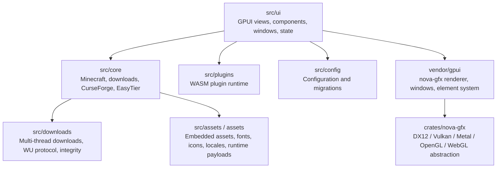

# Better Minecraft Bedrock Launcher

[中文](README.md)

Better Minecraft Bedrock Launcher (BMCBL) is a Rust + GPUI desktop launcher for
Minecraft Bedrock Edition. The project has fully moved away from the old
Tauri / WebView / React stack. The current goal is a native Windows launcher
that can download, manage, launch, connect, and edit Bedrock worlds from a
single desktop application.

> Supported platform: Windows. Linux source paths exist but are not a release
> target yet. macOS is not supported and is not planned.

## Status

| Area | Status |
| --- | --- |
| UI framework | Native GPUI, no WebView |
| Primary platform | Windows 10 / Windows 11 |
| Minecraft version types | UWP and GDK, including release / preview / education branches |
| Renderer | GPUI nova-gfx path, Nova DX12 by default on Windows, configurable Nova Vulkan |
| Plugin system | WASM sandbox plugins, API version `0.4` |
| License | GPL-3.0-only |

## Features

### Launching And Versions

- Scan and manage local Minecraft Bedrock UWP / GDK installations.
- Recognize release, preview, education, and education preview branches.
- Run launch prerequisite checks for UWP developer mode, UWP dependencies, and
  GDK GameInput.
- Configure launch arguments, launcher visibility after launch, and UWP minimize
  behavior.
- Support debug console, isolated mode, editor mode, disabled mod loading, mouse
  locking, and custom unlock hotkeys.
- Provide `BLoader.dll` based mod injection, injection delay, and mod type
  configuration.

### Downloads

- Download game versions with search, release / preview filters, local package
  detection, redownload, CDN probing, and source selection.
- Browse CurseForge resources with categories, subcategories, version filters,
  sorting, pagination, and list / grid views.
- Install Bedrock add-ons, maps, skins, texture packs, scripts, and related
  resource types.
- Import CurseForge share content from the clipboard.
- Configure multi-threaded downloads, automatic thread count, maximum threads,
  system / HTTP / SOCKS5 proxy modes.
- Select official, MCIM mirror, or custom CurseForge API base URLs.

### Resource And World Management

- Manage mods, resource packs, behavior packs, worlds, screenshots, and server
  lists per Minecraft version.
- Search, sort, import, back up, delete, open folders, enable, and disable
  resources.
- Mark mod types such as native, preload, hot-inject, and LSE QuickJS.
- Launch worlds, export worlds, and edit NBT / `level.dat` from world entries.
- Scan GDK user directories for screenshots.
- Read server lists and query MOTD, version, player count, and latency.

### Advanced Map Window

The map window is a major GPUI feature, not just a simple world preview.

- 2D map tile rendering streams visible viewport tiles immediately without
  waiting for full-world indexing.
- Supports Surface, Biome, Height, Layer, and Cave render modes.
- Supports Overworld, Nether, End, and custom dimensions.
- Provides interactive pan, zoom, positioning, and on-demand tile chunk trees.
- Uses render sessions, cache policies, tile manifests, decoded tile caches, and
  cancellable generation-based pipelines.
- Surfaces CPU budget, cache hit / miss counts, GPU backend diagnostics, and
  fallback reasons.
- Chunk operations include range selection, selection statistics, chunk delete,
  and chunk reset.
- Record operations include deleting block entities / actors and editing block
  entities, actors, hardcoded spawn areas, HeightMap, Biome Storage, map records,
  and global records.
- Chunk copy / paste supports single-chunk and multi-chunk paste, rotation,
  mirroring, paste previews, and explicit write confirmation.
- `.mcstructure` import / export supports selected-region export, structure
  preview, and world paste.
- 3D preview is available for structures or selections.
- Player editing supports inspection plus quick actions such as move to map
  center, set dimension, and clear inventory.
- Edit history captures chunk delete, reset, paste, record save / delete, player
  edits, and `level.dat` saves, with undo / redo and restore points.
- Write mode must be explicitly enabled before world mutation.

See [docs/MAP_RENDERER.md](docs/MAP_RENDERER.md) for map rendering details.

### Online Play

- EasyTier-based online play panel.
- Create or join rooms and display room code, network name, peers, and virtual
  IPv4.
- Configure NAT checks, player name, and game ports.
- Use automatic public bootstrap peers or manual bootstrap peer lists.
- Toggle compatibility options such as `disable_p2p` and `no_tun`.
- Show peer state, game endpoint, and runtime logs.

### Customization And Settings

- Runtime language switching: auto, Simplified Chinese, Traditional Chinese,
  English, Japanese, and Korean.
- Renderer and GPU adapter selection.
- Theme color, default / local / network background, background blur, and glass
  effect settings.
- Embedded fonts, local font files, and installed system fonts.
- Stable / nightly update channels, automatic update checks, and manual update
  checks.
- Crash diagnostics, log tails, GitHub Issue flow, Sentry reporting switches,
  and Sentry test logs.
- Connectivity checks for launcher services, Microsoft / Xbox services, and
  community resource services.

### Plugins

BMCBL plugins are WASM sandbox plugins, not the old JavaScript plugin model.

- Plugin manifest file: `plugin.toml`; package extension: `.bmcblx`.
- Current plugin API version: `0.4`; manifest schema version: `2`.
- Plugins can register navigation pages, windows, UI injection slots, and global
  event subscriptions.
- Host operations include toasts, navigation, windows, modals, clipboard, HTTP
  text requests, resource reads, KV storage, task progress, config read / write,
  theme snapshots, and app info.
- Capabilities and allowlists control permissions such as `network.http`,
  `storage.kv`, `config.read`, `config.write`, `ui.page`, and `ui.window`.
- The settings page exposes plugin enabled state, permissions, config, README,
  logs, and diagnostics export.
- Examples live in `examples/plugins/hello-wasm` and
  `examples/plugins/bedrock-notes`.

## Architecture

BMCBL is now a native GPUI desktop application. The Tauri compatibility layer has
been removed. The default build does not include a web frontend, WebView, or
Tauri command wrappers.



Main directories:

| Path | Purpose |
| --- | --- |
| `src/ui` | GPUI pages, components, windows, theme, and app state |
| `src/core` | Minecraft, versions, maps, packs, online play, CurseForge |
| `src/downloads` | Download tasks, multi-thread downloads, WU protocol, integrity |
| `src/plugins` | WASM plugin loading, sandbox execution, UI DSL, hot reload, packages |
| `src/i18n` | Runtime localization |
| `src/config` | Config structs, defaults, migrations, and persistence |
| `assets` | Compile-time icons, fonts, images, locales, and binary payloads |
| `vendor/gpui` | Project-maintained GPUI framework code |
| `crates/nova-gfx` | Cross-backend graphics abstraction used by the GPUI nova renderer path |
| `crates/bmcbl-plugin-api` | Plugin ABI, macros, and packaging tools |
| `crates/gpui-hooks` | GPUI hooks helpers |
| `crates/lucide-gpui` | Lucide icon adapter for GPUI |

Current structure: [docs/BMCBL_PROJECT_STRUCTURE.md](docs/BMCBL_PROJECT_STRUCTURE.md).
Architecture boundaries: [docs/ARCHITECTURE_BOUNDARIES.md](docs/ARCHITECTURE_BOUNDARIES.md).
GPUI renderer notes: [docs/GPUI_VENDOR_RENDERING.md](docs/GPUI_VENDOR_RENDERING.md).
Router and hooks: [docs/GPUI_ROUTER_HOOKS.md](docs/GPUI_ROUTER_HOOKS.md).

## Development

### Requirements

- Windows 10 / Windows 11.
- Rust stable with edition 2024 support.
- MSVC toolchain and Windows SDK.
- Git.
- Network access to Cargo registry and the EasyTier Git dependency.

The current `Cargo.toml` uses several local path dependencies. By default,
`BE-Community-Dev` is expected next to this repository:

```text
workspace-root/
  BMCBL/
  BE-Community-Dev/
    mc-motd/
    bedrock-world/
    bedrock-render/
    bedrock-block-model/
```

If your layout differs, update the corresponding `path` dependencies in
`Cargo.toml`.

### Build And Run

```powershell
cargo run --bin BMCBL
cargo build --release --bin BMCBL
```

Optional features:

```powershell
cargo run --bin BMCBL --features gpui-windows-vulkan
cargo run --bin BMCBL --features preview-3d-dx12
```

`build.rs` embeds Windows icon / manifest resources, fonts, localization,
images, `BLoader.dll`, and EasyTier runtime payload metadata. EasyTier
`wintun.dll` / `WinDivert64.sys` are discovered from local vendored paths or
Cargo Git checkouts. Missing files produce warnings and may disable some online
play modes.

### Checks

```powershell
cargo fmt --all
cargo test --workspace
```

Project Rust conventions:

- edition 2024.
- `unsafe_code = "warn"`.
- Clippy `all` and `pedantic` are warnings.
- Avoid `unwrap()` in library code; propagate errors with `?`.
- Every `unsafe` block needs a `// SAFETY:` comment.
- UI render code should not own network IO, parsing, caches, downloads, or
  durable workflows.

### Plugin Development

Install the WASM target:

```powershell
rustup target add wasm32-unknown-unknown
```

Build example plugins:

```powershell
cargo build --manifest-path examples/plugins/hello-wasm/Cargo.toml --release --target wasm32-unknown-unknown
cargo build --manifest-path examples/plugins/bedrock-notes/Cargo.toml --release --target wasm32-unknown-unknown
```

The example plugin `build.rs` files call
`bmcbl_plugin_api::pack::auto_pack_from_build_script()` to generate `.bmcblx`
packages automatically. Manual packaging is available through
`bmcbl-plugin-tools` in `crates/bmcbl-plugin-api`.

### Localization

Locale files live in `assets/locales/*.lang`; user agreement markdown lives in
`assets/locales/agreement/*.md`. When adding UI strings, update the locale keys
and run:

```powershell
scripts/check_i18n_lang.ps1
```

## Development Notes

- Do not reintroduce Tauri, WebView, Vite, or React as the main UI stack.
- GPUI framework code must not depend on BMCBL routes, pages, assets, download
  services, or window policy.
- `src/ui` renders and coordinates UI state. Network IO, parsing, downloads,
  caches, and persistence belong in backend modules.
- Before changing the map window, read `docs/MAP_RENDERER.md` and preserve
  visible-tile streaming, cache behavior, and cancellation generation semantics.
- World write features must keep explicit confirmation, history capture, and
  user-visible error reporting.
- Runtime assets should be embedded through `build.rs` or `include_bytes!` /
  `include_str!`; DLLs or drivers that must exist on disk should be extracted
  into local app data / cache directories.

## Credits

- MCAPPX: version index and metadata support.
- MCMrARM / mc-w10-version-launcher: Windows Update protocol and version
  discovery references.
- BedrockLauncher.Core: GDK unpacking and Bedrock implementation references.
- EasyTier: online play foundation.
- Aetopia / AppLifecycleOptOut: UWP minimize freeze fix reference.
- MCIM: CurseForge mirror and download acceleration.
- GPUI / Zed GPUI: native UI and renderer foundation.

## License And Disclaimer

BMCBL is licensed under GPL-3.0-only. It is intended for learning, research, and
community use.

Minecraft, Minecraft Bedrock Edition, related trademarks, assets, and services
belong to Mojang Studios / Microsoft. This project is not an official Mojang or
Microsoft product and is not affiliated with them.
