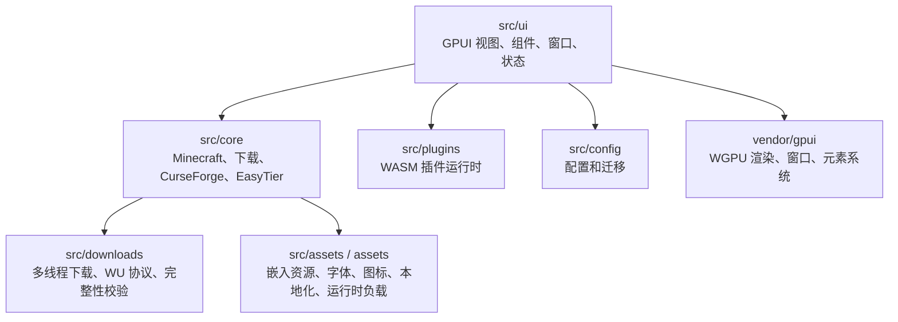

# Better Minecraft Bedrock Launcher

[English](README.en.md)

Better Minecraft Bedrock Launcher（BMCBL）是一个使用 Rust + GPUI 构建的
Minecraft Bedrock Edition 桌面启动器。当前版本已经从 Tauri / WebView / React
架构完全迁移到 GPUI 原生界面，核心目标是在 Windows 上提供可下载、可管理、可联机、
可编辑地图的单体桌面启动器。

> 当前支持平台：Windows。Linux 仅保留部分源码路径，暂不作为发布目标；macOS 现在和
> 后续都不在支持计划内。

## 项目状态

| 项目 | 状态 |
| --- | --- |
| UI 框架 | GPUI 原生界面，非 WebView |
| 主要平台 | Windows 10 / Windows 11 |
| Minecraft 版本类型 | UWP、GDK，含正式版 / 预览版 / 教育版相关分支 |
| 渲染后端 | GPUI WGPU 优先，Windows 可使用 DX12 / Vulkan 路径 |
| 插件系统 | WASM 沙箱插件，API 版本 `0.4` |
| 许可证 | GPL-3.0-only |

## 核心功能

### 游戏启动与版本管理

- 扫描并管理本地 Minecraft Bedrock UWP / GDK 版本。
- 支持正式版、预览版、教育版、教育预览版等分支的版本识别与启动入口。
- 启动前检查 UWP 开发者模式、UWP 运行依赖、GDK GameInput 等必要条件。
- 支持启动参数、启动器启动后保持 / 最小化 / 关闭、UWP 最小化修复等行为配置。
- 支持调试控制台、隔离模式、编辑器模式、禁用 Mod 加载、鼠标锁定和自定义解锁热键。
- 内置 `BLoader.dll` 相关 Mod 注入能力，支持注入延迟和多种 Mod 类型配置。

### 下载中心

- 游戏版本下载：版本搜索、正式 / 预览筛选、本地包识别、重新下载、下载源测速与选择。
- CurseForge 资源浏览：分类、子分类、版本筛选、排序、分页、列表 / 网格视图。
- CurseForge 资源安装：支持 Addon、地图、皮肤、材质包、脚本等 Bedrock 资源类型。
- 分享导入：支持从剪贴板识别 CurseForge 分享内容并打开安装流程。
- 下载设置：多线程、自动线程数、最大线程数、系统 / HTTP / SOCKS5 代理。
- CurseForge API 来源可切换官方、MCIM 镜像或自定义基址。

### 资源与存档管理

- 按版本管理 Mod、资源包、行为包、地图、截图和服务器列表。
- 支持搜索、排序、导入、备份、删除、打开目录、启用 / 禁用资源。
- Mod 管理支持类型标记：原生、预加载、热注入、LSE QuickJS 等。
- 地图条目支持启动地图、导出地图、编辑 NBT / `level.dat`。
- 截图页支持 GDK 用户目录扫描和截图列表管理。
- 服务器页支持读取服务器列表并查询 MOTD、版本、在线人数和延迟。

### 高级地图窗口

地图窗口是当前 GPUI 版本的重点能力，不只是简单查看存档。

- 2D 地图瓦片渲染：按当前视口流式渲染可见瓦片，不等待完整世界索引。
- 支持 Surface、Biome、Height、Layer、Cave 等渲染模式。
- 支持主世界、下界、末地和自定义维度。
- 交互式缩放、拖动、定位，按需加载当前瓦片的区块树。
- 渲染会话使用缓存策略、瓦片 manifest、解码瓦片缓存和可取消的 generation 管线。
- 支持 CPU 预算、缓存命中 / 未命中、GPU 后端、回退原因等诊断信息。
- 区块操作：选择区块范围、统计选区、删除区块、重置区块。
- 记录操作：删除当前区块方块实体、删除实体，编辑方块实体、实体、硬编码生成区域、
  HeightMap、Biome Storage、地图记录和全局记录。
- 复制 / 粘贴区块：支持单区块和多区块复制粘贴、旋转、镜像、粘贴预览和确认写入。
- `.mcstructure`：支持选区导出为结构文件，也支持导入结构文件并预览 / 粘贴到世界。
- 3D 预览：支持结构或选区的 3D 预览面板。
- 玩家编辑：查看玩家数据，支持移动到地图中心、切换维度、清空背包等快速操作。
- 历史记录：区块删除、重置、粘贴、记录保存 / 删除、玩家编辑、`level.dat` 保存都会
  捕获历史，可撤销 / 重做，并带有回档保护点。
- 写入模式默认需要显式开启，避免误改世界数据。

更多渲染管线细节见 [docs/MAP_RENDERER.md](docs/MAP_RENDERER.md)。

### 联机

- 基于 EasyTier 的联机面板。
- 支持创建房间、加入房间、显示房间码、网络名、节点和虚拟 IPv4。
- 支持 NAT 检测、玩家名、游戏端口配置。
- 支持自动公共节点，也可手动填写引导节点。
- 支持 `disable_p2p`、`no_tun` 等兼容性开关。
- 显示在线节点、连接地址和运行日志。

### 个性化与设置

- 多语言：自动跟随系统，内置简体中文、繁体中文、英语、日语、韩语。
- 渲染器设置：可选择渲染后端和 GPU 适配器。
- 主题定制：主题色、默认 / 本地 / 网络背景、背景模糊、玻璃效果。
- 字体定制：内置字体、本地字体文件、系统字体。
- 更新设置：正式 / 夜版通道、自动检查更新、手动检查更新。
- 诊断与上报：异常退出报告、日志尾部、GitHub Issue、Sentry 上报开关和测试日志。
- 服务连通性测试：启动器核心服务、微软 / Xbox 服务、社区与资源服务。

### 插件系统

BMCBL 的插件系统已经不是旧版 JavaScript 插件，而是 WASM 沙箱插件。

- 插件清单文件为 `plugin.toml`，包格式为 `.bmcblx`。
- 当前插件 API 版本为 `0.4`，manifest schema 版本为 `2`。
- 插件可注册导航页、独立窗口、UI 注入点和全局事件订阅。
- Host 能力包括 Toast、导航、窗口、模态框、剪贴板、HTTP 文本请求、资源读取、
  KV 存储、任务进度、配置读写、主题快照和应用信息。
- 插件权限使用 capability 和 allowlist 控制，如 `network.http`、`storage.kv`、
  `config.read`、`config.write`、`ui.page`、`ui.window` 等。
- 设置页提供插件启用状态、权限、配置、README、日志和诊断导出。
- 示例插件位于 `examples/plugins/hello-wasm` 和 `examples/plugins/bedrock-notes`。

## 技术架构

BMCBL 现在是 GPUI 原生桌面应用。Tauri 兼容层已经删除，默认构建不包含 Web 前端、
WebView 或 Tauri command wrapper。



主要目录：

| 路径 | 说明 |
| --- | --- |
| `src/ui` | GPUI 页面、组件、窗口、主题和应用状态 |
| `src/core` | Minecraft、版本、地图、资源包、联机、CurseForge 等核心逻辑 |
| `src/downloads` | 下载任务、多线程下载、Windows Update 协议和完整性校验 |
| `src/plugins` | WASM 插件加载、沙箱执行、UI DSL、热更新和包安装 |
| `src/i18n` | 运行时多语言切换 |
| `src/config` | 配置结构、默认值、迁移和持久化 |
| `assets` | 编译期嵌入的图标、字体、图片、本地化和二进制负载 |
| `vendor/gpui` | 本项目维护的 GPUI 框架代码 |
| `crates/bmcbl-plugin-api` | 插件 ABI、宏和打包工具 |
| `crates/gpui-hooks` | GPUI hooks 辅助库 |
| `crates/lucide-gpui` | Lucide 图标到 GPUI 的适配 |

架构边界见 [docs/ARCHITECTURE_BOUNDARIES.md](docs/ARCHITECTURE_BOUNDARIES.md)。
GPUI 渲染细节见 [docs/GPUI_VENDOR_RENDERING.md](docs/GPUI_VENDOR_RENDERING.md)。
路由和 hooks 见 [docs/GPUI_ROUTER_HOOKS.md](docs/GPUI_ROUTER_HOOKS.md)。

## 开发环境

### 必要条件

- Windows 10 / Windows 11。
- Rust stable，项目使用 edition 2024。
- MSVC 工具链和 Windows SDK。
- Git。
- 可访问 Cargo registry 和 EasyTier Git 依赖。

当前 `Cargo.toml` 使用了若干本地 path 依赖，默认期望 `BE-Community-Dev` 与本仓库
位于同级目录：

```text
workspace-root/
  BMCBL/
  BE-Community-Dev/
    mc-motd/
    bedrock-world/
    bedrock-render/
    bedrock-block-model/
```

如果目录不同，需要同步修改 `Cargo.toml` 中对应的 `path` 依赖。

### 构建与运行

```powershell
cargo run --bin BMCBL
cargo build --release --bin BMCBL
```

可选 feature：

```powershell
cargo run --bin BMCBL --features gpui-windows-vulkan
cargo run --bin BMCBL --features preview-3d-dx12
```

`build.rs` 会嵌入 Windows 图标 / manifest、字体、本地化、图片、`BLoader.dll` 和
EasyTier 运行时负载元数据。EasyTier 的 `wintun.dll` / `WinDivert64.sys` 会从本地
vendored 目录或 Cargo Git checkout 中查找；缺失时构建会给出 warning，部分联机模式
可能不可用。

### 常用检查

```powershell
cargo fmt --all
cargo test --workspace
```

项目约定 Rust 代码使用：

- edition 2024。
- `unsafe_code = "warn"`。
- Clippy `all` 和 `pedantic` 为 warn。
- 库代码避免 `unwrap()`，优先使用 `?` 传播错误。
- 所有 `unsafe` 块必须写 `// SAFETY:` 注释。
- UI 逻辑遵守 `src/ui` 模块职责划分，避免把 IO、解析、缓存和长任务塞进 render 方法。

### 插件开发

安装 WASM target：

```powershell
rustup target add wasm32-unknown-unknown
```

构建示例插件：

```powershell
cargo build --manifest-path examples/plugins/hello-wasm/Cargo.toml --release --target wasm32-unknown-unknown
cargo build --manifest-path examples/plugins/bedrock-notes/Cargo.toml --release --target wasm32-unknown-unknown
```

示例插件的 `build.rs` 会调用 `bmcbl_plugin_api::pack::auto_pack_from_build_script()`，
自动生成 `.bmcblx` 包。也可以使用 `crates/bmcbl-plugin-api` 中的 `bmcbl-plugin-tools`
进行手动打包。

### 本地化

本地化文件位于 `assets/locales/*.lang`，用户协议文本位于
`assets/locales/agreement/*.md`。新增 UI 文案时需要同步补齐对应语言键值，并可运行：

```powershell
scripts/check_i18n_lang.ps1
```

## 开发注意事项

- 不要重新引入 Tauri、WebView、Vite 或 React 作为主界面依赖。
- GPUI framework 代码不得依赖 BMCBL 应用路由、页面、资源、下载服务或窗口策略。
- `src/ui` 只负责渲染和协调 UI 状态；网络 IO、解析、下载、缓存和持久化流程应放在
  `src/core`、`src/downloads`、`src/config` 或其他后端模块中。
- 修改地图窗口时优先查看 `docs/MAP_RENDERER.md`，保持可见瓦片流式渲染、缓存和取消
  generation 语义。
- 处理世界写入功能时必须保留显式确认、历史捕获和错误反馈，不能静默丢弃失败。
- 新增运行时资源应通过 `build.rs` 或 `include_bytes!` / `include_str!` 嵌入；必须落盘的
  DLL 或驱动负载应写入本地 app data / cache 目录。

## 致谢

- MCAPPX：版本索引与元数据支持。
- MCMrARM / mc-w10-version-launcher：Windows Update 协议和版本获取思路参考。
- BedrockLauncher.Core：GDK 解包等 Bedrock 相关实现参考。
- EasyTier：联机模块基础能力。
- Aetopia / AppLifecycleOptOut：UWP 最小化停滞修复参考。
- MCIM：CurseForge 镜像和下载加速服务。
- GPUI / Zed GPUI：原生 UI 和渲染框架基础。

## 版权与免责声明

BMCBL 遵循 GPL-3.0-only。项目仅用于学习、研究和社区交流。

Minecraft、Minecraft Bedrock Edition 及相关商标、素材和服务归 Mojang Studios /
Microsoft 所有。本项目不是 Mojang 或 Microsoft 的官方产品，也不与其存在从属关系。
