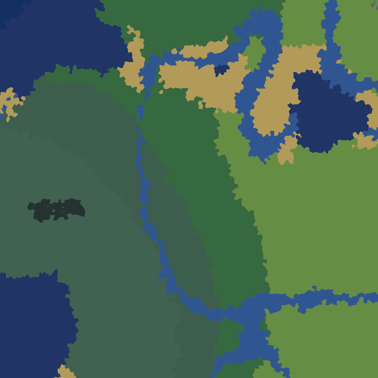
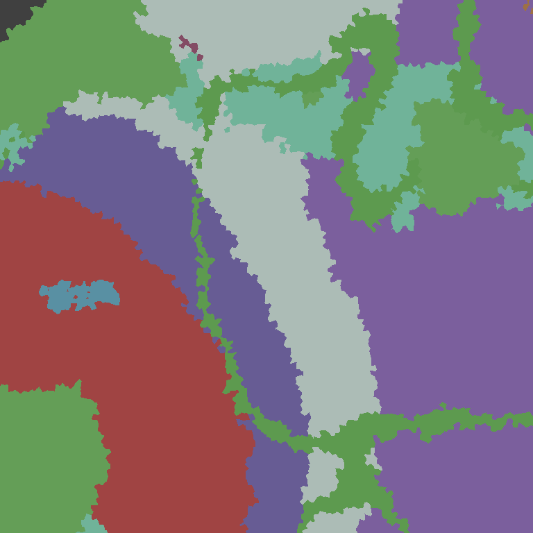
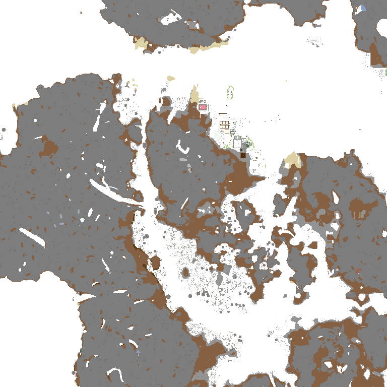
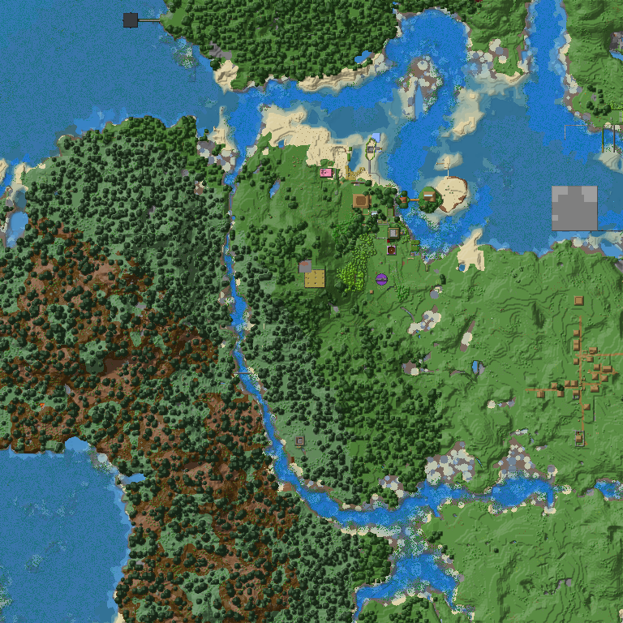
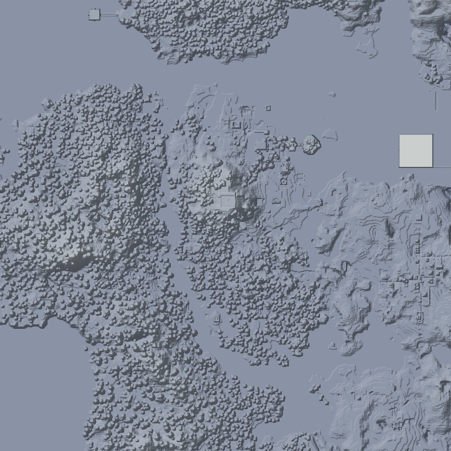
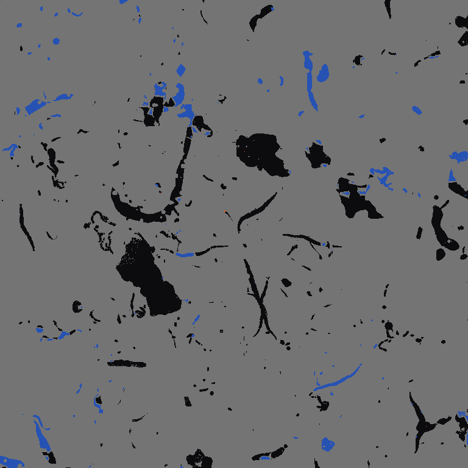

# bedrock-render

[English](README.md) | [简体中文](README.zh-CN.md)

`bedrock-render` 是 Minecraft Bedrock 世界瓦片渲染库。它依赖
`bedrock-world` 查询 Bedrock LevelDB、NBT、chunk、subchunk、高度图和 biome 数据。
渲染、调色板、瓦片规划、图片编码、取消、线程、预览和 benchmark 独立在这个 crate
中维护，避免把图片依赖塞进核心世界解析库。

本仓库按独立 checkout 使用整理。当前 MSRV 是 Rust 1.88，默认特性包含
`async` 和 `webp`。GPU 后端通过 `gpu`、`gpu-dx11`、`gpu-vulkan` 或
`gpu-dx12` 显式启用。CPU-only 用户可以使用 `--no-default-features`，再按需启用图片格式特性。

## 设计

- 所有渲染输出都是 X/Z 平面图。`Y` 只表示采样层或高度选择参数。
- 瓦片由 `RenderLayout` 控制。默认布局是每张图 `16x16` 个 chunk，每像素一个方块，
  输出 `256x256` 图片。更大的 `blocks_per_pixel` 会保持同样世界范围，但用更低细节
  更快渲染大地图预览。
- `ChunkRegion` 支持任意矩形 chunk 区域。
- Web-map 路径稳定且能安全失效缓存：
  `<world>/<signature>/r<renderer>-p<palette>/<dimension>/<mode>/<layout>/<tile_x>/<tile_z>.<ext>`。
- `world_cache_identity(path)` 会在一次世界元数据快照中计算稳定的世界 cache ID
  和当前内容签名；需要单个值的调用方仍可使用兼容函数 `world_cache_id` 和
  `world_cache_signature`。
- 批量 tile 使用有界 worker。`Auto` 会根据执行 profile 解析：`Export` 使用当前机器逻辑
  CPU 数，`Interactive` 使用更保守的前台安全线程数；显式线程数支持 `1..=512`。
- Web-map 导出使用全局 chunk bake 队列、按内存预算分 wave、并行 tile compose/encode
  和有界 MPMC writer queue，避免 CPU worker 被 `fs::write` 串行阻塞。
- Region/Web tile 渲染在 direct tile、shared bake、streaming session 和 GPU prepare
  中复用同一套 chunk-to-region 坐标 helper。trace 日志会报告 region chunk copy、
  out-of-bounds chunk 和 missing region sample，方便区分解析数据错误和合成坐标错误。
- 交互式前端应为每个打开的世界创建一个 `MapRenderSession`。session 持有 renderer、
  tile cache 和诊断上下文，拖拽/缩放时不会为每批 tile 重新打开 world 或重建缓存。
- `RenderMemoryBudget::Auto` 会给 chunk bake 和导出 wave 设置有界缓存预算；
  离线工具也可以使用 `FixedBytes` 或 `Disabled`。
- 长任务支持显式取消和进度回调。

## 渲染模式

- `RenderMode::Biome { y }`：指定 Y 层的 biome 色彩图。
- `RenderMode::RawBiomeLayer { y }`：调试用 biome id 色彩图。
- `RenderMode::LayerBlocks { y }`：指定世界 Y 层的方块平面图。
- `RenderMode::SurfaceBlocks`：主俯视地形图。每个 X/Z 列从真实加载的方块自顶向下采样，
  不再把 Bedrock Data2D/Data3D/Legacy heightmap 当作渲染事实；仍会应用 biome tint、
  薄层混合，并把透明水体和下方实体方块混合。
- `RenderMode::HeightMap`：基于同一套真实表面列采样的高度渐变图。
- `RenderMode::RawHeightMap`：基于 Bedrock Data2D/Data3D/Legacy 原始 heightmap 的诊断图。
- `RenderMode::CaveSlice { y }`：指定 Y 层洞穴诊断图，区分空气、实体方块、水和熔岩。

`SurfaceBlocks` 和默认 `HeightMap` 现在共用 canonical terrain sampler：先由
`bedrock-world` 对现代 subchunk、legacy subchunk 或 `LegacyTerrain` 真实方块列做 top-down
扫描并给出唯一视觉表面样本，renderer 只负责烘焙颜色、真实表面高度、relief 高度和水深。原始 heightmap 只作为 hint/诊断保留，
需要旧 raw 行为时使用 `RawHeightMap`。缺失 chunk 或空地形会被视为没有地形，
不会误渲染成灰色地图块。
固定 Y 层调试继续使用 `LayerBlocks { y }`。
未知方块会渲染为不透明紫色诊断像素；缺失 chunk、缺失 height map 和空地形会渲染为
透明像素，并在 `RenderDiagnostics` 中单独计数。

旧版 Bedrock/Pocket Edition 世界通过
`bedrock-world::RenderChunkData::legacy_terrain` 和结构化 `legacy_biomes`
支持。对于纯 `LegacyTerrain` chunk，`SurfaceBlocks` 和 `HeightMap` 使用固定
`0..=127` 高度范围，`LayerBlocks` 和 `CaveSlice` 直接采样旧 numeric block ID。
常见 0.16 方块 ID 会映射到现代 `minecraft:*` 名称；未知 ID 走正常
unknown-block 诊断路径。过渡 chunk 如果同时有 `LegacyTerrain` 和
`SubChunkPrefix`，优先使用 subchunk 方块数据，legacy terrain 只作为 fallback。
旧版 biome RGB 会优先于旧 Data2D/Data3D biome id，用于 `Biome` 输出和草/树叶 tint；`RawBiomeLayer`
在 palette 已知该 biome id 时使用 id 诊断色，未知旧 id 时回退到保存的 RGB。
真实 legacy payload 按 `[biome_id, red, green, blue]` 解码，`legacy_biome_colors`
只是兼容用 `0x00RRGGBB` 视图。水体继续使用正常 water tint，不使用草地 RGB。

Renderer cache version `51` 会让旧的错位、高度错误、legacy biome 优先级错误、
raw-height 驱动的瓦片缓存，以及 authority cache index/blob 之前的缓存布局失效。
`RenderOptions::default()` 现在默认绕过 tile cache；需要读写缓存的 session/export 路径必须显式设置 `cache_policy: RenderCachePolicy::Use`。
长期 session 会使用 tile authority cache 记录最终 tile blob、空 tile、chunk dependency stamp
和 chunk 到 tile 的反向引用，再决定是否信任缓存中的解码像素。

## API 示例

```rust
use std::sync::Arc;
use bedrock_render::{
    ChunkRegion, ImageFormat, MapRenderer, RenderExecutionProfile, RenderLayout,
    RenderMemoryBudget, RenderMode, RenderOptions, RenderPalette, RenderThreadingOptions,
};

let world = bedrock_world::World::open(
    "path/to/minecraftWorld",
    bedrock_world::OpenOptions::default(),
)?;
let renderer = MapRenderer::new(Arc::new(world), RenderPalette::default());
let region = ChunkRegion::new(dimension, -32, -32, 31, 31);
let layout = RenderLayout {
    chunks_per_tile: 16,
    blocks_per_pixel: 1,
    pixels_per_block: 1,
};

let tiles = renderer.render_region_tiles(
    region,
    RenderMode::HeightMap,
    layout,
    RenderOptions {
        format: ImageFormat::WebP,
        threading: RenderThreadingOptions::Auto,
        execution_profile: RenderExecutionProfile::Export,
        memory_budget: RenderMemoryBudget::Auto,
        ..RenderOptions::default()
    },
)?;
```

示例和工具建议使用 `bedrock_world::World::open` 或
`World::open`，不要直接构造 LevelDB storage。这样可以自动识别旧版
LevelDB `LegacyTerrain` 世界和只读 `chunks.dat` 世界。

## 编辑门面

`bedrock_render::editor` 是面向地图查看器和工具的下游适配门面，不是
`bedrock-world` 的核心存储 API。普通渲染 source 默认保持只读；已经进入显式写入模式的
应用可以使用 `MapWorldEditor` 调用常用 `bedrock-world` typed write API，并获得
render/UI 层的失效摘要。

```rust
use bedrock_render::editor::{MapWorldEditor, WorldScanOptions};

let editor = MapWorldEditor::open_writable("path/to/minecraftWorld")?;
let hsa = editor.hardcoded_spawn_areas(WorldScanOptions::default())?;

let invalidation = editor.delete_hardcoded_spawn_areas(chunk_pos)?;
if invalidation.refresh_overlays() {
    // 重新读取当前视口 overlay
}
if invalidation.clear_tile_cache() {
    // 清理覆盖 invalidation.affected_chunks() 的渲染瓦片缓存
}
```

应用层仍应在每次写入前做二次确认。写入成功后先递增 UI generation，再调度 overlay
和 tile 重新加载，避免旧后台任务覆盖新状态。`MapEditInvalidation` 只是渲染层缓存刷新
contract，不会写入 Bedrock 数据，也不属于 `bedrock-world` 的 storage layer。

## Streaming Session API

`MapRenderSession` 是 GPUI 和其它交互式地图查看器的高性能入口。它会随着工作完成
持续产生 tile event，复用 world 句柄和 tile cache，支持取消，并能在 bake 前使用
`bedrock-world` 的 render-index API 跳过不存在渲染记录的 chunk。

```rust
use std::sync::Arc;
use bedrock_render::{
    ChunkRegion, ImageFormat, MapRenderSession, MapRenderSessionConfig,
    MapRenderer, RenderCachePolicy, RenderCancelFlag, RenderExecutionProfile,
    RenderLayout, RenderMode, RenderOptions, RenderPalette, RenderTilePriority,
    TileStreamEvent,
};

let renderer = MapRenderer::new(Arc::new(world), RenderPalette::default());
let session = MapRenderSession::new(
    renderer,
    MapRenderSessionConfig {
        cache_root: "target/bedrock-render-cache".into(),
        world_id: "viewer".into(),
        world_signature: "leveldb-manifest-and-leveldat-signature".into(),
        cull_missing_chunks: true,
        ..MapRenderSessionConfig::default()
    },
);

let layout = RenderLayout::default();
let region = ChunkRegion::new(dimension, -32, -32, 31, 31);
let planned_tiles = MapRenderer::plan_region_tiles(region, RenderMode::SurfaceBlocks, layout)?;
let cancel = RenderCancelFlag::new();

session.render_web_tiles_streaming(
    &planned_tiles,
    RenderOptions {
        format: ImageFormat::WebP,
        execution_profile: RenderExecutionProfile::Interactive,
        cache_policy: RenderCachePolicy::Use,
        cancel: Some(cancel.clone()),
        priority: RenderTilePriority::DistanceFrom { tile_x: 0, tile_z: 0 },
        ..RenderOptions::default()
    },
    |event| {
        match event {
            TileStreamEvent::Cached { planned, encoded } => {
                // 解码或直接交给 UI 图片缓存。
            }
            TileStreamEvent::Rendered { planned, tile } => {
                // 立即展示 tile.rgba，并保留 tile.encoded 给 cache。
            }
            TileStreamEvent::Failed { planned, error } => {
                eprintln!("tile failed: {error}");
            }
            TileStreamEvent::Progress(progress) => {
                eprintln!("tiles {}/{}", progress.completed_tiles, progress.total_tiles);
            }
            TileStreamEvent::Complete { diagnostics, stats } => {
                eprintln!("cache hits={} gpu={:?}", stats.cache_hits, stats.resolved_backend);
            }
        }
        Ok(())
    },
)?;
```

### 迁移：阻塞批量渲染到可取消 streaming

旧代码通常使用 `render_web_tiles`，整批完成后才更新 UI：

```rust
renderer.render_web_tiles(&planned_tiles, options, |planned, tile| {
    write_tile(planned, tile)?;
    Ok(())
})?;
```

现在应复用长期 session，并把 tile event 流式推给前端：

```rust
let session = MapRenderSession::new(renderer, MapRenderSessionConfig::default());
let cancel = RenderCancelFlag::new();
session.render_web_tiles_streaming(
    &planned_tiles,
    RenderOptions {
        cancel: Some(cancel),
        cache_policy: RenderCachePolicy::Use,
        ..options
    },
    |event| {
        enqueue_tile_event(event)?;
        Ok(())
    },
)?;
```

旧批量 API 继续保留给导出工具；新的交互式代码应把 session streaming API 作为主要入口。

`render_streaming_session` example 展示了同样的事件流：

```text
cargo run --example render_streaming_session -- <world_path>
```

如果 UI 图片缓存希望直接接收解码后的像素，可以使用
`render_web_tiles_streaming_v2`、`render_web_tiles_streaming_v2` 或
`render_web_tiles_streaming_channel_v2`。这些接口会通过
`TileStreamEventV2::Ready` 返回 `DecodedTileImage`；默认像素格式是
`TilePixelFormat::Rgba8`，也可以通过 `RenderTileOutputOptions` 请求 `Bgra8`。

## 预览工具

预览 example 会生成 6 张 atlas PNG 和 web-map tile 目录：

```text
cargo run --example render_preview --features png
```

可选参数：

```text
render_preview <world_path> <output_dir> <center_tile_x> <center_tile_z> \
  <viewport_tiles> <layer_y> <cave_y> <chunks_per_tile>
```

预览输出结构：

```text
<output_dir>/
  biome-viewport.png
  raw-biome-viewport.png
  layer-y64-viewport.png
  surface-viewport.png
  heightmap-viewport.png
  raw-heightmap-viewport.png
  cave-y32-viewport.png
  web-tiles/sample/signature/r2-p1/overworld/heightmap/16c-1bpp/25/12.png
```

## Web 地图导出

`render_web_map` 会导出 WebP 瓦片和一个自包含的静态 HTML 查看器。它用于验证渲染器，
也可以生成可分享的 web-map 产物，不依赖 GPUI 或 CDN。未传 `--region` 时，会自动
发现并渲染每个选中维度的已加载 chunk bounds。

```text
cargo run --example render_web_map -- \
  --world ../bedrock-world/tests/fixtures/sample-bedrock-world \
  --out target/bedrock-web-map \
  --dimensions overworld,nether,end \
  --mode surface,heightmap,biome,layer \
  --chunks-per-tile 16 \
  --chunks-per-region 32 \
  --blocks-per-pixel 4 \
  --threads auto \
  --profile export \
  --memory-budget auto \
  --pipeline-depth 256 \
  --tile-batch-size auto \
  --writer-threads 2 \
  --write-queue-capacity 256 \
  --stats \
  --force
```

输出结构：

```text
target/bedrock-web-map/
  viewer.html
  map-layout.json
  map-data.js
  tiles/<dimension>/<mode>/<layout>/<tile_z>/<tile_x>.webp
```

`map-layout.json` 是自动生成的地图布局数据，供工具或其它前端读取；`map-data.js`
只内置最小布局常量，并动态提供 `tileBounds()`、`tileId()`、`tilePath()`。瓦片位置由固定
目录规则 `tiles/<dimension>/<mode>/<layout>/<tile_z>/<tile_x>.webp` 推导，HTML 查看器
直接通过普通脚本加载它。这样从 `file://` 打开 `viewer.html` 时不需要 `fetch()` JSON，
也不会触发浏览器 CORS。导出会在打开和扫描世界前先写出 `viewer.html`、`map-layout.json`
和 `map-data.js`；后续发现维度 bounds、完成每个模式渲染时，`map-layout.json`/
`map-data.js` 会逐步刷新布局和统计数据。查看器会定时重新加载 `map-data.js` 并重试
当前视口瓦片，所以导出仍在运行时也能逐步看到新写入的图片。
它支持维度切换、模式切换、拖拽平移、滚轮缩放、瓦片坐标和加载失败提示。
大地图导出前建议使用 `--region` 限制范围，或提高 `--blocks-per-pixel` 降低输出体积。
8 核 16 线程机器推荐默认 `--profile export --threads auto`；UI 或交互式预览使用
`--profile interactive`。只有离线导出且磁盘能跟上时，才建议手动提高到更大的固定线程数，
最大 512。`--stats` 会输出 planned tiles、unique chunks、baked chunks、bake/encode/write
耗时、cache 命中和峰值缓存字节，用于判断 CPU 占用不足到底来自 I/O、编码还是 chunk bake。
缺失 chunk、缺失 subchunk、固定 Y 层未加载区域都会透明；不透明紫色表示已经读取到
真实方块名，但当前 palette 没有对应颜色映射。

## 外部调色板

默认 palette 已内置到 crate 和编译后的二进制中。它包含两份可审计 JSON 源文件：

```text
data/colors/bedrock-block-color.json
data/colors/bedrock-biome-color.json
```

`RenderPalette::default()` 会从内置 JSON 源构建 palette，所以普通渲染不需要外部
palette 文件。JSON 仍可以通过
`RenderPalette::builtin_block_color_json()` 和
`RenderPalette::builtin_biome_color_json()` 获取，用于审计和工具。内置数据由本项目
维护用于 Bedrock 渲染；loader 同时理解旧式对象映射 palette JSON，便于应用导入
自有授权颜色数据，不依赖其他渲染器。

如果项目拥有自己的合法颜色数据，`RenderPalette` 也支持额外用户 JSON 覆盖：

```text
--palette-json target/bedrock-block-color.json
--palette-json target/bedrock-biome-color.json
```

JSON 是导入/覆盖格式。可染色方块在 block 源中使用 mask，最终渲染色由 biome tint
决定。JSON loader 支持带
`schema_version` / `sources` / `blocks` / `defaults` / `biomes` 的组合对象、
`{"minecraft:stone":"#7d7d7d"}` 这样的对象映射，
包含 `name` / `id` 和 `color` 字段的数组，也支持旧式多纹理对象映射结构作为用户
本地参考数据。

Palette 源文件维护命令：

```text
cargo run --example palette_tool -- audit --check
cargo run --example palette_tool -- generate-clean-room --check
cargo run --example palette_tool -- normalize --check
```

来源策略和公开参考资料见 [docs/PALETTE_SOURCES.md](docs/PALETTE_SOURCES.md)。

最近一次本地参考 palette smoke 运行：

```text
cargo run --example render_web_map -- \
  --world ../bedrock-world/tests/fixtures/sample-bedrock-world \
  --out target/bedrock-web-map-ref-palette \
  --region 0,0,15,15 \
  --mode surface,heightmap,biome,layer \
  --y 64 \
  --palette-json target/bedrock-block-color.json \
  --palette-json target/bedrock-biome-color.json \
  --force

loaded palette JSON target\bedrock-block-color.json: block_colors=1211 biome_colors=0 skipped=0
loaded palette JSON target\bedrock-biome-color.json: block_colors=0 biome_colors=88 skipped=0
overworld surface tiles=1 missing=0 transparent=0 unknown=0
overworld layer-y64 tiles=1 missing=0 transparent=12544 unknown=0
```

最近一次本地 debug 预览结果：

```text
cargo run --example render_preview --features png
surface diagnostics: missing_chunks=0 missing_heightmaps=0 unknown_blocks=0 fallback_pixels=0
preview output: target/bedrock-render-preview
```

最近一次本地 WebP web-map smoke 运行：

```text
cargo run --example render_web_map -- \
  --world ../bedrock-world/tests/fixtures/sample-bedrock-world \
  --out target/bedrock-web-map \
  --region 0,0,15,15 \
  --mode surface,heightmap,biome,layer \
  --threads auto \
  --tile-batch-size auto \
  --writer-threads 2 \
  --write-queue-capacity 64 \
  --force

已生成 viewer.html、map-layout.json、map-data.js，以及 overworld/nether/end 的 WebP 瓦片。
LayerBlocks 的透明像素表示固定 Y 层未加载区域，这是预期行为。
```

## 渲染效果示例

这些图片由预览工具基于当前默认调色板生成。地形视图参考 BedrockMap 风格的俯视
地图行为，同时属于这个独立公开渲染库的输出。

### `Biome { y }`

在指定 Y 层采样的 X/Z 平面 biome 色彩图。



### `RawBiomeLayer { y }`

调试用 biome id 色彩图。未知或稀疏 id 会被有意显示出来。



### `LayerBlocks { y }`

指定世界 Y 层的 X/Z 方块平面图。这个模式不是侧面剖切图。



### `SurfaceBlocks`

主俯视地形图。每个 X/Z 列从实际方块列自顶向下计算真实表面方块和高度，
应用 biome tint，并把透明水体与下方实体方块混合。默认叠加轻量高度法线明暗，避免地形
看起来完全平面。`SurfaceRenderOptions::block_boundaries` 会叠加柔和的 2D 单方块描边
和高低差接触阴影，让悬崖、道路、同色方块边界更容易辨认，同时不切换到 2.5D 视角；
高度数值分析请使用 `HeightMap`，原始 heightmap 诊断请使用 `RawHeightMap`。



### `HeightMap`

基于真实表面列采样生成的高度渐变图，语义与 `SurfaceBlocks` 的表面高度一致。
如果需要查看世界文件保存的原始 Data2D/Data3D/Legacy heightmap，请使用 `RawHeightMap`。



### `CaveSlice { y }`

指定 Y 层洞穴诊断图，用于区分空气、实体方块、水和熔岩。



## 性能模型

- `Biome`、`RawBiomeLayer`、`RawHeightMap`、`LayerBlocks`、`CaveSlice` 只预取当前 tile
  需要的 chunk record。
- `SurfaceBlocks` 和 `HeightMap` 会读取完整相关 subchunk 并计算 canonical
  `16x16` 表面列；原始 heightmap mismatch 会进入 load stats，用于定位坏高度提示。
- 缺失 chunk 或没有真实表面方块的列会进入 diagnostics，并按无地形处理。
- Subchunk 访问统一走 `SubChunk::block_state_at(local_x, local_y, local_z)`，避免
  renderer 内复制 palette index 公式。
- Web 导出使用 region-first bake 管线。`--chunks-per-region` 控制烘焙缓存单元；
  大地图默认推荐 `32`，小范围验证或交互预览需要更低首屏延迟时可用 `16`。
- Web 导出不会把完整地图的所有 region bake 常驻内存；renderer 会按
  `--memory-budget` 分 wave 烘焙、合成、写盘。`--pipeline-depth` 和
  `--write-queue-capacity` 只限制已编码瓦片等待写盘的队列深度。
- `SurfaceBlocks` 使用 chunk bake：先从 `bedrock-world` 的列样本把每个 chunk
  规约成 `16x16` 地形图，再把 baked chunk 像素拼成 region plane 和 WebP tile。
- 静态查看器使用 `RenderLayout` 自动比例。小地图默认全细节，大地图可用 2/4/8
  blocks per pixel 快速预览，但不改变单个 tile 覆盖的世界范围。
- 缓存 key 包含世界路径 hash、世界文件签名、renderer 版本、palette 版本、维度、模式、
  Y 层和布局。UI 会拒绝全透明的陈旧缓存瓦片并重新生成；authority cache 还会记录
  chunk dependency stamp 和 chunk 到 tile 的反向引用，用于校验和失效。
- `ImageFormat::Rgba` 是 UI 纹理最低延迟路径；WebP/PNG 适合缓存、导出和预览。
- `RenderOptions::gpu` 控制 GPU 合成调度。`max_in_flight=0`、`batch_size=0`、
  `batch_pixels=0`、`submit_workers=0`、`readback_workers=0`、
  `buffer_pool_bytes=0` 和 `staging_pool_bytes=0` 会使用按 profile 选择的默认值；
  导出任务允许比交互任务更多 in-flight GPU work。
- `RenderOptions::cpu` 控制有界 CPU 队列深度和 chunk batch 大小；
  `RenderOptions::priority` 可让交互式 session 优先渲染当前视口中心附近的 tile。
- GPU compose 在单个 `wgpu` device 上使用有界并发队列；交互式 session 默认会把多个
  cache miss 组成小批量，但 tile ready 后仍立即流式返回。单个 tile 的 GPU 失败会
  fallback 到 CPU，并记录 `gpu_fallback_reason`。stats 也会暴露 world load/decode、
  region copy、GPU prepare/upload/dispatch/readback、GPU batch tile、submit/readback
  worker 和 buffer/staging pool 复用情况。
- 静态 web-map example 会把 WebP 瓦片写到
  `tiles/<dimension>/<mode>/<layout>/<tile_z>/<tile_x>.webp`；瓦片之间不会有缝隙，
  缺失世界数据用透明像素表示。
- 查看器集成可以以世界 `level.dat` 的重生点为初始中心，支持维度/自定义维度切换，
  并把 WebP web-map tile 写入应用缓存目录。

## 测试和 Benchmark

```text
cargo fmt --all -- --check
cargo clippy --all-features --all-targets -- -D warnings
cargo test --all-features
cargo test --no-default-features
cargo doc --no-deps --all-features
cargo rustdoc --lib --all-features -- -D missing_docs
cargo bench --bench render --all-features
```

默认 benchmark 套件覆盖瓦片渲染、chunk bake、小批量渲染和 v0.2.0 editor 门面扫描。完整 web-map 导出 benchmark
默认关闭；运行前先把 `benches/render.rs` 中的 `RUN_FULL_BENCHMARKS` 改为 `true`：

```text
cargo bench --bench render --all-features
```

如果只需要固定字段的机器可读报告，而不是完整 Criterion 采样，可以使用一个不匹配任何
case 的过滤器：

```text
cargo bench --bench render --all-features -- --noplot __machine_report_only__
```

当前大地图基线使用
`C:\Users\Administrator\Desktop\BE-Community-Dev\bedrock-world\tests\fixtures\sample-bedrock-world`。
2026-05-07 的本地报告如下：

```text
bedrock_render_report case=surface_region_rgba storage=generic backend=default elapsed_ms=582 tiles=1 worker_threads=1 world_worker_threads=1 prefix_scans=0 exact_get_batches=1 exact_keys_requested=7424 exact_keys_found=2558 db_read_ms=256 decode_ms=234 gpu_tiles=0 cpu_tiles=1 gpu_requested=Auto gpu_actual=Auto gpu_adapter=none gpu_device=none gpu_fallback=none gpu_upload_ms=0 gpu_dispatch_ms=0 gpu_readback_ms=0 gpu_uploaded_bytes=0 gpu_readback_bytes=0 gpu_peak_in_flight=0 gpu_buffer_reuses=0
bedrock_render_report case=v02_overlay_query storage=editor elapsed_ms=14957 chunks=256 entities=0 block_entities=64 hsa=0 villages=182
bedrock_render_report case=v02_map_scan storage=editor elapsed_ms=188 records=1760
bedrock_render_report case=v02_global_scan storage=editor elapsed_ms=1149 records=0 scoreboard_found=false error=Bedrock_world_error:_NBT_error:_unknown_NBT_tag_type:_52
bedrock_render_report case=v02_hsa_scan storage=editor elapsed_ms=1797 chunks=842 areas=1703
bedrock_render_report case=v02_edit_invalidation storage=memory elapsed_ns=14100 affected_chunks=2 refresh_metadata=true refresh_overlays=true clear_tile_cache=true
bedrock_render_report case=surface_region_rgba storage=dynamic backend=default elapsed_ms=576 tiles=1 worker_threads=1 world_worker_threads=1 prefix_scans=0 exact_get_batches=1 exact_keys_requested=7424 exact_keys_found=2558 db_read_ms=264 decode_ms=235 gpu_tiles=0 cpu_tiles=1 gpu_requested=Auto gpu_actual=Auto gpu_adapter=none gpu_device=none gpu_fallback=none gpu_upload_ms=0 gpu_dispatch_ms=0 gpu_readback_ms=0 gpu_uploaded_bytes=0 gpu_readback_bytes=0 gpu_peak_in_flight=0 gpu_buffer_reuses=0
```

这里 `prefix_scans=0` 且 `exact_get_batches=1` 表示 sampled surface region 已走
`bedrock-world` exact batch 读取路径；`storage=generic` 是 typed storage 热路径，
`storage=dynamic` 是兼容动态 trait 路径。

更多细节见 [docs/API.md](docs/API.md)、[docs/TESTING.md](docs/TESTING.md) 和
[docs/BENCHMARKS.md](docs/BENCHMARKS.md)。

## 当前限制

- V1 不实现实体标记或文字标签。
