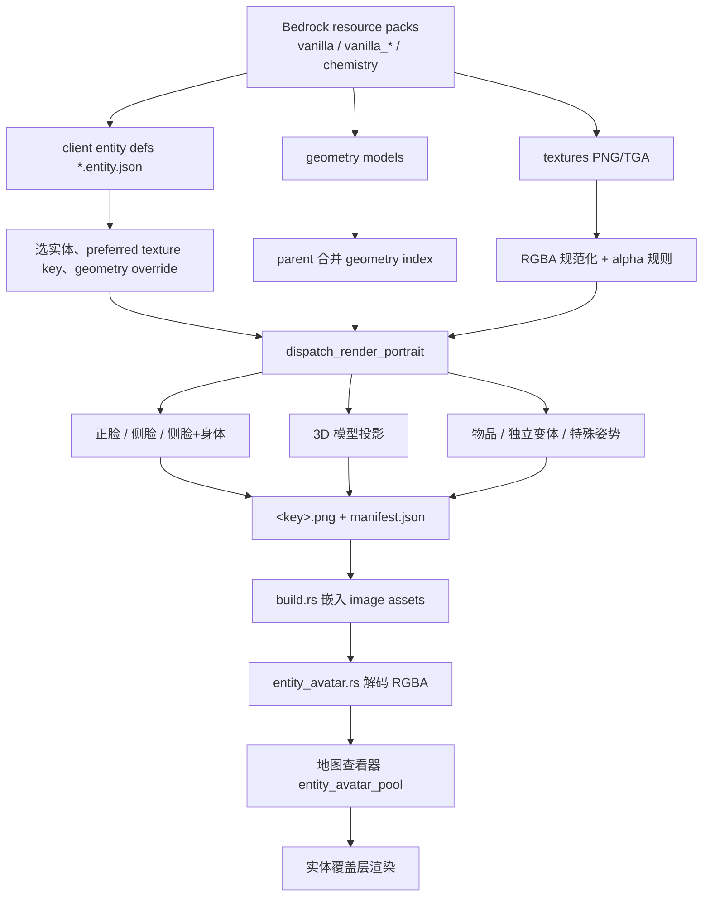
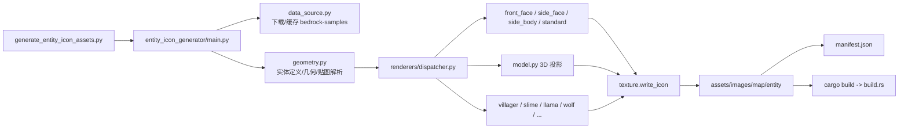

# BMCBL 当前项目规划

> 状态：地图实体图标与脚本渲染管线的当前推进计划
> 日期：2026-08-05
> 适用范围：`scripts/entity_icon_generator`、`assets/images/map/entity`、
>   `src/core/minecraft/entity_avatar.rs`、地图查看器实体覆盖层
> 目标平台：Windows（构建期脚本与运行时均以 Windows 为主）

## 1. 仓库对比

| 项目 | 当前值 |
| --- | --- |
| 本地分支 | `master` @ `7a1ead6f` |
| 远程 | `origin` = <https://github.com/Chlna6666/Better-Minecraft-Bedrock-Launcher.git> |
| 远端对应 | `origin/master` @ `7a1ead6f`，与本地提交一致 |
| 当前 tag | `v0.2.0-nightly.20260805.67` |
| 其他远端分支 | `tauri`、`agent/linux-release-nightly`、`ci/compile-check-cache-test`、`temp-map-render-revert`、`temp-map-render-revert-2` |

本地工作区相对于远端的主要差异：

- `assets/images/map/entity/*.png` 批量更新，部分旧图标被删除（例如 `magma_cube`、
  `pufferfish`、`strider`、`tadpole`、投射物/药水类图标），并新增 `agent.png`、
  `skull.png`。
- `assets/images/map/entity/manifest.json` 已同步为当前生成结果。
- `scripts/generate_entity_icon_assets.py` 精简为入口，主体拆到
  `scripts/entity_icon_generator/`。
- 根目录 `probe_*.png`、`scripts/_render_probe.py`、`scripts/__pycache__` 等属于
  调试/临时产物，规划中不提交。

## 2. 当前规划

目标：把地图实体图标从“手工维护的旧资源”迁移为“脚本可复现、版本可固定、格式可
校验”的 PNG 资产管线，并让地图查看器的实体覆盖层直接消费同一目录。

### 2.1 阶段

| 阶段 | 内容 | 状态 |
| --- | --- | --- |
| P0 拆包 | 将单文件生成脚本重构为 `entity_icon_generator` 包 | 工作区完成 |
| P1 数据源 | 自动获取/缓存 Mojang bedrock-samples，按 tag 固定 | 基本完成 |
| P2 渲染器 | 正脸/侧脸/侧脸加身体/3D 投影/物品与独立变体 | 基本完成 |
| P3 输出格式 | 稳定 PNG 尺寸、`manifest.json`、别名与回退 | 基本完成 |
| P4 运行时接入 | build.rs 嵌入 + `entity_avatar` 解码 + 地图覆盖层 | 已具备，重新生成后需构建验证 |
| P5 覆盖与清理 | 覆盖审计、删除不可达图标、清理 probe 产物、提交 | 进行中 |

### 2.2 完成标准

- 生成脚本可从本地 resource packs 或 `bedrock-samples` 缓存复现输出。
- `assets/images/map/entity/manifest.json` 中每个键都有对应 PNG。
- 所有 PNG 可被 `src/core/minecraft/entity_avatar.rs` 解码，且尺寸/通道合法。
- 地图查看器 `entity_avatar_pool` 能覆盖当前 Bedrock 版本实体标识，含
  `minecraft:` 前缀归一化。
- 不提交 probe 图、调试脚本和 `__pycache__`。

## 3. 格式说明

### 3.1 输入格式

| 输入 | 说明 |
| --- | --- |
| `*.entity.json` | Bedrock client entity 定义，JSONC，支持注释 |
| `models/entity/*.json`、`models/mobs.json` | 几何模型，兼容 legacy `format_version 1.8/1.10` 与 `minecraft:geometry` 列表；带 `parent` 的模型会合并 |
| `textures/**/*.png`、`textures/**/*.tga` | 实体贴图，脚本统一转为 RGBA 并处理低 alpha |
| resource packs | 默认读取已安装版本目录 `target/debug/BMCBL/versions/26.33/data/resource_packs`，也可用 `bedrock-samples/<tag>/resource_pack` 缓存 |

`ENTITY_RESOURCE_PACK_PINS` 可把特定实体固定到某个 pack（例如 `bogged` 固定到
`vanilla_1.21.90`），避免先命中旧 pack 导致贴图布局不匹配。

### 3.2 输出格式

| 项目 | 规则 |
| --- | --- |
| PNG | `assets/images/map/entity/<key>.png`，RGBA，默认 64x64 |
| 命名 | `minecraft:foo-bar` -> `foo_bar`，统一小写 |
| 缩放 | 不透明内容裁剪后按 NEAREST 等比缩放，默认 2px inset 居中 |
| 覆盖 | `ghast`/`happy_ghast` 128px；camel 系列有 crop/offset 覆盖 |
| manifest | `manifest.json` 为排序后的 `{entity_key: file_name}` |
| 别名 | `villager_v2` 复用 `villager` 输出 |
| 运行时 | build.rs 将整个目录作为 image assets 嵌入，Rust 端不读 manifest，直接按文件名解码 |

`manifest.json` 示例：

```json
{
  "agent": "agent.png",
  "allay": "allay.png",
  "zombie_villager_v2": "zombie_villager_v2.png"
}
```

## 4. 说明

### 4.1 渲染器分类

| 类别 | 入口 | 覆盖 |
| --- | --- | --- |
| 正脸（默认） | `renderers/front_face.py` | 大部分实体 |
| 侧脸 | `renderers/side_face.py` | `sniffer`、`turtle` 等 |
| 侧脸加身体 | `renderers/side_body.py` + `standard.render_head_neck_profile` | 鱼、海豚、马/驴/骡等 |
| 3D 模型投影 | `renderers/model.py` | `armor_stand`、`guardian`、`ghast`、minecart 等 |
| 物品精灵 | `renderers/items.py` + `SPECIAL_ITEMS` | `boat`、`chest_boat`、`end_crystal` |
| 独立变体 | villager/slime/llama/rabbit/wolf/cat/sheep/goat/parrot/nautilus/armadillo | 对应复杂头部或身体结构 |
| 模型回退 | `model_fallbacks` | `egg`、`snowball`、`trident`、`xp_orb`、部分 minecart |

### 4.2 特殊处理

- `hoglin`/`zoglin` 使用 south 面并镜像，避免脸被翻转。
- `guardian`/`elder_guardian` 烘焙尖刺张开姿势。
- `evocation_fang` 烘焙张嘴姿势。
- `xp_orb` 输出黄绿色光球。
- `balloon` 使用物品贴图并染色。
- `zombie_horse` 的 64x64 贴图放大到 128x128，以匹配马几何 UV。
- 低 alpha 保留（羊/蜘蛛/末影人）或强制不透明（烈焰人/发光鱿鱼）。

## 5. 地图实体图



## 6. 脚本渲染图



常用命令：

```powershell
python scripts/generate_entity_icon_assets.py
python scripts/generate_entity_icon_assets.py --resource-pack "D:\packs\vanilla" --output assets\images\map\entity
```

## 7. 支持范围

- 构建期脚本与运行时解耦：脚本生成源资产，build.rs 嵌入，Rust 端只消费嵌入结果。
- 地图查看器覆盖层支持实体 id 归一化（`minecraft:` 前缀、连字符转下划线）。
- `src/core/minecraft/entity_avatar.rs` 的 `generated_entity_avatar_catalog_is_decodable`
  测试覆盖 PNG 解码与像素长度合法性。
- 相关文档：[`MAP_RENDERER.md`](MAP_RENDERER.md)、
  [`PROJECT_SPEC.md`](PROJECT_SPEC.md)、
  [`BMCBL_PROJECT_STRUCTURE.md`](BMCBL_PROJECT_STRUCTURE.md)。
