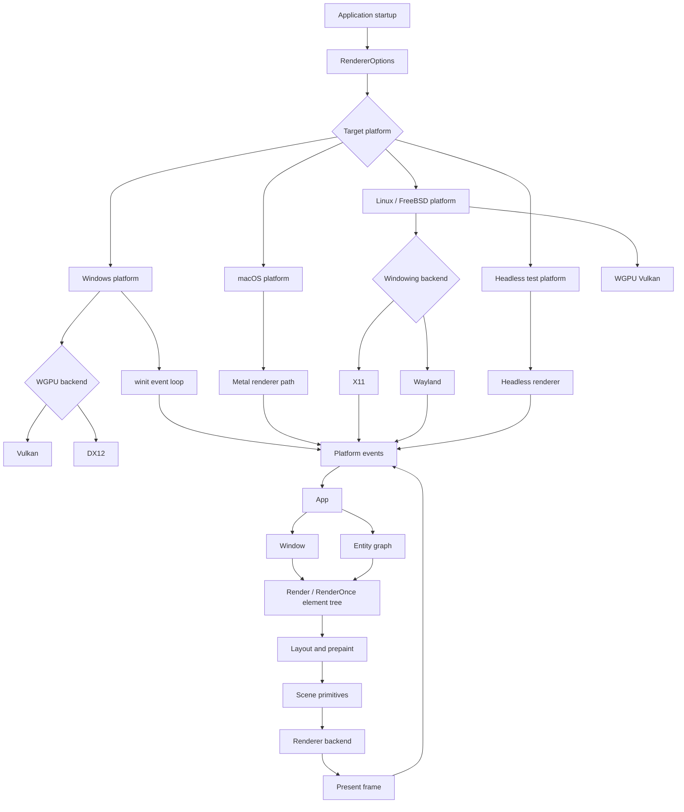
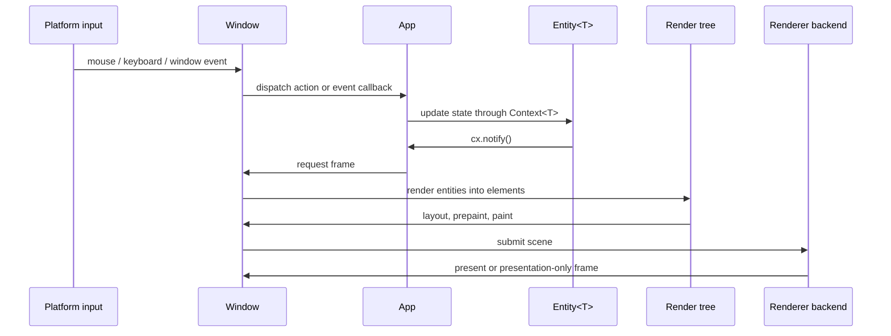
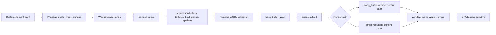

# GPUI

[中文](README.zh-CN.md)

GPUI is a hybrid immediate and retained mode, GPU-accelerated UI framework for
Rust desktop applications. It provides application state, windows, entity-based
views, declarative elements, input dispatch, platform integration, and renderer
backends in one crate.

This branch keeps GPUI pre-1.0 while updating the renderer and platform
direction:

- Windows uses a WGPU and winit based platform path.
- The default renderer direction is WGPU-first, with Vulkan and DX12 backend
  selection on Windows.
- The compositor is event driven by default. Continuous rendering is reserved
  for explicit `RenderPolicy::Continuous` configuration.
- Custom WGPU surfaces can render application-owned GPU content and then paint
  that surface into the GPUI scene.
- WGSL shaders can be validated at build time for built-in renderer shaders or
  loaded at runtime for custom examples and applications.
- The examples are updated for the current `App`, `Context<T>`, `Window`, and
  `Entity<T>` API shape.

## Quick Start

Add GPUI to a Rust 2024 project and create an `Application`:

```toml
[dependencies]
gpui = { version = "0.2.2" }
```

```rust
use gpui::{div, App, Application, Context, Render, Window};
use gpui::prelude::*;

struct Hello;

impl Render for Hello {
    fn render(&mut self, _window: &mut Window, _cx: &mut Context<Self>) -> impl IntoElement {
        div().child("Hello from GPUI")
    }
}

fn main() {
    Application::new().run(|cx: &mut App| {
        cx.open_window(Default::default(), |_, cx| cx.new(|_| Hello))
            .expect("open window");
        cx.activate(true);
    });
}
```

## Core Concepts

- `App` is the root context for globals, windows, entities, menus, key
  bindings, assets, and platform services.
- `Context<T>` is provided while creating, updating, rendering, or handling
  events for an `Entity<T>`.
- `Window` is passed explicitly to render and event code that needs input,
  focus, drawing, frame requests, actions, or custom WGPU surfaces.
- `Entity<T>` stores GPUI-owned state. Update entities through `Entity::update`
  or a `Context<T>` listener, and call `cx.notify()` when rendering should
  change.
- `Render` views build element trees every frame. `RenderOnce` components are
  lightweight element recipes that are consumed when rendered.
- `cx.spawn(async move |cx| ...)` and `window.spawn(cx, async move |cx| ...)`
  run foreground async work. Use `cx.background_spawn` for work that must not
  block UI rendering.

Obsolete application-facing names should not be used in new code:
`Model<T>`, `View<T>`, `AppContext` as a context type, `ModelContext<T>`,
`WindowContext`, and `ViewContext<T>`.

## Architecture

GPUI is organized around a foreground UI thread, entity state, explicit window
state, and a renderer backend selected at application startup.



### Frame Flow

The normal frame path is event-driven. State changes notify entities, windows
coalesce frame requests, and the renderer only redraws when scene state or
presentation state requires it.



### Custom WGPU Surface Flow

Custom GPU content uses GPUI's WGPU device and queue while keeping application
rendering isolated from GPUI's element renderer.



### Original GPUI Architecture Comparison

| Area | Original GPUI direction | This branch |
| --- | --- | --- |
| Windows platform | DirectX-oriented Windows renderer path | WGPU and winit based Windows platform path |
| Windows backend selection | Platform-specific renderer implementation | `RendererBackend` can select WGPU Vulkan or WGPU DX12 |
| Renderer default | Platform renderer chosen internally | WGPU-first direction where supported, with explicit renderer options |
| Frame scheduling | Redraw behavior tied closely to platform renderer loops | Event-driven composition with presentation-only frame support |
| Shader model | Built-in renderer shaders owned by platform paths | Built-in WGSL validation plus runtime WGSL helpers for custom surfaces |
| Custom GPU content | Framework rendering primitives are the main extension point | Application-owned WGPU surfaces can be painted into the GPUI scene |
| Example API style | Older examples may use previous context and view terminology | Examples use `App`, `Context<T>`, explicit `Window`, and `Entity<T>` |

## Renderer Notes

`RendererOptions` controls backend selection, GPU adapter selection, present
mode preference, render policy, and frame metrics. `RendererBackend::Auto`
selects a platform default. On Windows, explicit `WgpuVulkan` and `WgpuDx12`
selection is available.

Event-driven rendering is the default. `RequestFrameOptions::force_render`
marks layout and paint as dirty; `RequestFrameOptions::require_presentation`
allows a presentation-only frame when prepared content or a WGPU surface needs
to become visible.

For custom GPU content, create a `WgpuSurfaceHandle` with
`Window::create_wgpu_surface`, render into `back_buffer_view`, call `present`
or `swap_buffers` depending on the render path, and paint it with
`Window::paint_wgpu_surface`.

## Documentation

- [Documentation index](docs/README.md)
- [Development guide](docs/development.md)
- [Contexts and entities](docs/contexts.md)
- [Runtime WGSL shaders](docs/runtime_wgsl_shaders.md)
- [WGPU surfaces](docs/wgpu_surfaces.md)
- [Examples](docs/examples.md)
- [Validation](docs/validation.md)

## Examples

The examples are kept on the current GPUI API surface:

```powershell
cargo check --manifest-path Cargo.toml --no-default-features --features windows-manifest,mimalloc-collect --examples
cargo run --manifest-path Cargo.toml --example hello_world
cargo run --manifest-path Cargo.toml --example minimal_window
cargo run --manifest-path Cargo.toml --example hatsune_miku_viewer
```

Some examples are platform-specific. The custom WGPU surface viewer currently
enables its full implementation on Windows.

## Validation

Use focused validation for this crate:

```powershell
cargo fmt --manifest-path Cargo.toml --all
cargo check --manifest-path Cargo.toml --no-default-features --features windows-manifest,mimalloc-collect
cargo clippy --manifest-path Cargo.toml --no-default-features --features windows-manifest,mimalloc-collect --lib -- -D warnings
cargo check --manifest-path Cargo.toml --no-default-features --features windows-manifest,mimalloc-collect --examples
```
