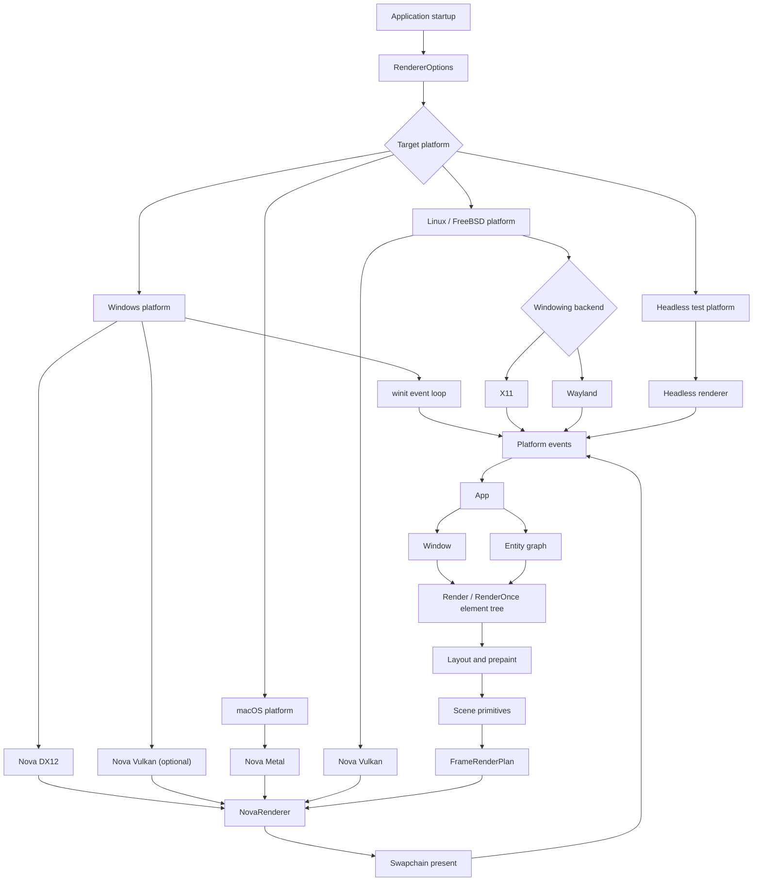
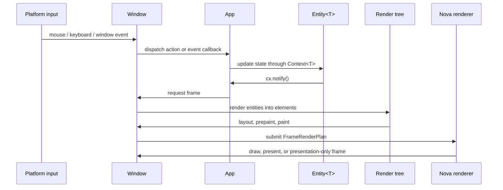

# GPUI

[中文](README.zh-CN.md)

GPUI is a hybrid immediate and retained mode, GPU-accelerated UI framework for
Rust desktop applications. It provides application state, windows,
entity-based views, declarative elements, input dispatch, platform integration,
and renderer backends in one crate.

This vendored branch is pre-1.0 and is maintained for BMCBL's native desktop
UI. The current renderer direction is nova-gfx:

- Windows uses a winit platform path and defaults to the Nova DX12 backend when
  the feature is enabled.
- Vulkan is available through the Nova Vulkan backend, including the optional
  Windows Vulkan feature path.
- macOS framework code targets Nova Metal for the normal nova-gfx path.
- The compositor is event driven by default. Continuous rendering is reserved
  for explicit `RenderPolicy::Continuous` configuration.
- Custom GPU content should enter GPUI through scene primitives, image
  elements, runtime WGSL shader helpers, or custom 3D mesh primitives rather
  than the removed application-facing surface API.
- WGSL shaders can be validated at build time for built-in renderer shaders or
  loaded at runtime for custom mesh examples and applications.
- The examples use the current `App`, `Context<T>`, explicit `Window`, and
  `Entity<T>` API shape.

## Quick Start

For an application in this repository, use the vendored path dependency:

```toml
[dependencies]
gpui = { path = "vendor/gpui", default-features = false, features = [
    "mimalloc-collect",
    "nova-gfx",
    "nova-gfx-dx12",
    "nova-gfx-vulkan",
] }
```

Create an `Application` and mount an entity view:

```rust
use gpui::prelude::*;
use gpui::{div, App, Application, Context, IntoElement, Render, Window};

struct Hello;

impl Render for Hello {
    fn render(&mut self, _window: &mut Window, _cx: &mut Context<Self>) -> impl IntoElement {
        div().child("Hello from GPUI")
    }
}

fn main() {
    Application::new().run(|cx: &mut App| {
        cx.open_window(Default::default(), |_, cx| cx.new(|_| Hello))
            .expect("open window");
        cx.activate(true);
    });
}
```

## Core Concepts

- `App` is the root context for globals, windows, entities, menus, key
  bindings, assets, and platform services.
- `Context<T>` is provided while creating, updating, rendering, or handling
  events for an `Entity<T>`.
- `Window` is passed explicitly to render and event code that needs input,
  focus, drawing, frame requests, actions, platform state, or custom paint.
- `Entity<T>` stores GPUI-owned state. Update entities through `Entity::update`
  or a `Context<T>` listener, and call `cx.notify()` when rendering should
  change.
- `Render` views build element trees. `RenderOnce` components are lightweight
  element recipes that are consumed when rendered.
- `cx.spawn(async move |cx| ...)` and `window.spawn(cx, async move |cx| ...)`
  run foreground async work. Use background executors or blocking tasks for
  work that must not block UI rendering.

Obsolete application-facing names should not be used in new code:
`Model<T>`, `View<T>`, `AppContext` as a context type, `ModelContext<T>`,
`WindowContext`, and `ViewContext<T>`.

## Architecture

GPUI is organized around a foreground UI thread, entity state, explicit window
state, and a renderer backend selected at application startup.



## Frame Flow

The normal frame path is event-driven. State changes notify entities, windows
coalesce frame requests, and the renderer only redraws when scene state or
presentation state requires it.



`RequestFrameOptions::force_render` marks layout and paint as dirty.
`RequestFrameOptions::require_presentation` allows a presentation-only frame
when prepared content or retained GPU output needs to become visible.

## Custom GPU Content

The old application-facing surface flow is not part of the current GPUI API.
New custom GPU content should use one of these paths:

- ordinary element painting into GPUI scene primitives;
- image and SVG elements;
- runtime WGSL shader modules for custom mesh pipelines;
- custom 3D mesh primitives with `GpuMesh3d`, `GpuMesh3dShader`, and
  `GpuMesh3dDrawParameters`;
- application-level render targets exposed through a deliberate GPUI scene or
  renderer extension point.

This keeps the renderer backend-neutral. Application code should not assume a
backend-specific device, queue, or surface handle.

## Original GPUI Architecture Comparison

| Area | Original GPUI direction | This vendored branch |
| --- | --- | --- |
| Windows platform | DirectX-oriented Windows renderer path | winit platform path with nova-gfx backends |
| Windows backend selection | Platform-specific renderer implementation | `RendererBackend` can select `NovaDx12` or `NovaVulkan` |
| Renderer default | Platform renderer chosen internally | Nova DX12 on Windows when available, Nova Vulkan on Linux/FreeBSD, Nova Metal on macOS |
| Frame scheduling | Redraw behavior tied closely to platform renderer loops | Event-driven composition with presentation-only frame support |
| Shader model | Built-in renderer shaders owned by platform paths | Built-in WGSL validation plus runtime WGSL helpers for custom mesh shaders |
| Custom GPU content | Framework rendering primitives are the main extension point | Scene primitives, images, SVG, runtime shader helpers, and custom mesh primitives |
| Example API style | Older examples may use previous context and view terminology | Examples use `App`, `Context<T>`, explicit `Window`, and `Entity<T>` |

## Renderer Notes

`RendererOptions` controls backend selection, GPU adapter selection, present
mode preference, GPU submission policy, render policy, and frame metrics.
`RendererBackend::Auto` chooses the platform default. Explicit backends include
`NovaDx12`, `NovaVulkan`, `NovaMetal`, and `HeadlessTest`.

The nova-gfx path converts GPUI scenes into frame upload buckets, GPU render
steps, optional offscreen path/backdrop passes, retained present-cache updates,
and swapchain presentation. Partial redraw is used when a dirty region can be
bounded safely; otherwise the renderer falls back to full redraw.

## Documentation

- [Documentation index](docs/README.md)
- [Development guide](docs/development.md)
- [Contexts and entities](docs/contexts.md)
- [Rendering and elements](docs/rendering.md)
- [Renderer backend](docs/renderer_backend.md)
- [Windows renderer backend](docs/windows_renderer_backend.md)
- [Runtime WGSL shaders](docs/runtime_wgsl_shaders.md)
- [Performance pipeline](docs/performance_pipeline.md)
- [Examples](docs/examples.md)
- [Validation](docs/validation.md)

BMCBL's integration-level renderer guide lives at
`../../docs/GPUI_VENDOR_RENDERING.md` from this directory.

## Examples

The examples are kept on the current GPUI API surface:

```powershell
cargo check --manifest-path Cargo.toml --no-default-features --features windows-manifest,mimalloc-collect,nova-gfx-dx12 --examples
cargo run --manifest-path Cargo.toml --example hello_world
cargo run --manifest-path Cargo.toml --example minimal_window
cargo run --manifest-path Cargo.toml --example image_gallery
```

Some examples are platform-specific. Runtime shader and custom mesh examples
must declare the renderer features they require.

## Validation

Use focused validation for this crate:

```powershell
cargo fmt --manifest-path Cargo.toml --all
cargo check --manifest-path Cargo.toml --no-default-features --features windows-manifest,mimalloc-collect,nova-gfx-dx12
cargo clippy --manifest-path Cargo.toml --no-default-features --features windows-manifest,mimalloc-collect,nova-gfx-dx12 --lib -- -D warnings
cargo check --manifest-path Cargo.toml --no-default-features --features windows-manifest,mimalloc-collect,nova-gfx-dx12 --examples
```
