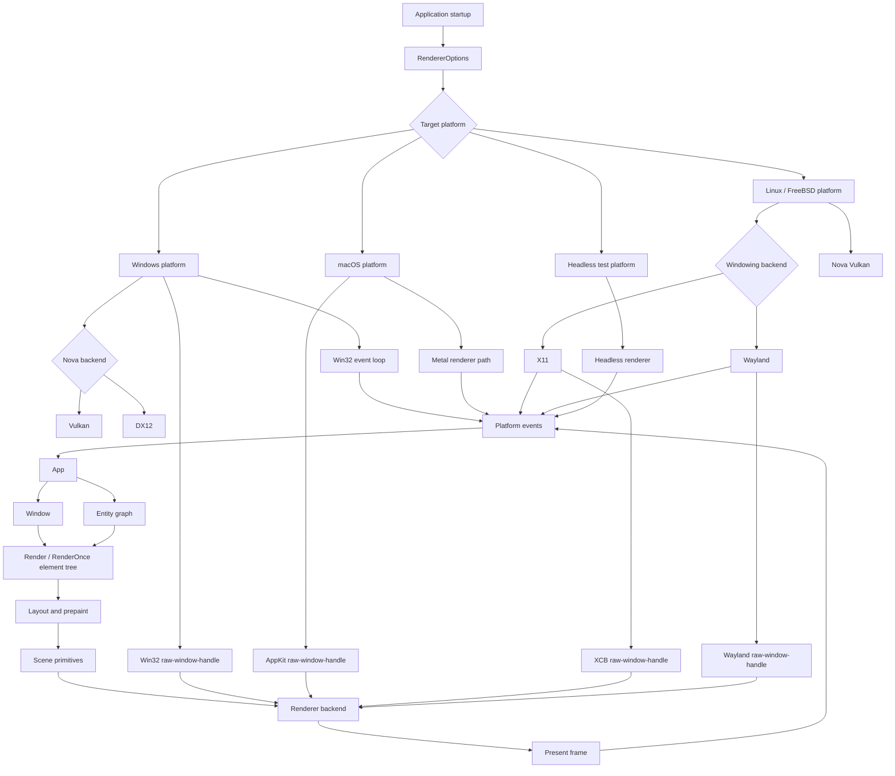
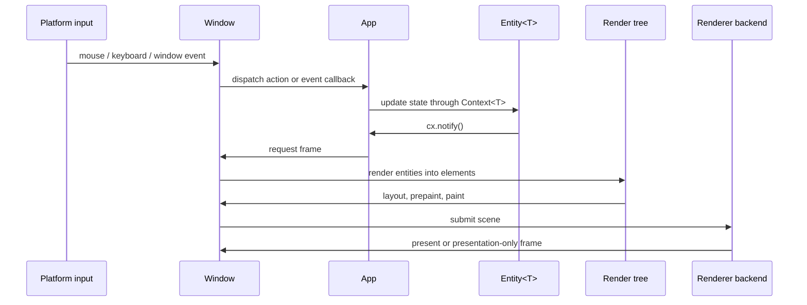
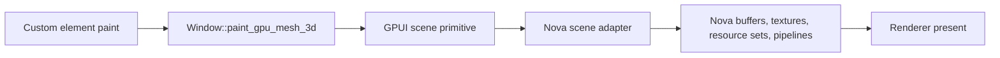

# GPUI

[中文](README.zh-CN.md)

GPUI is a hybrid immediate and retained mode, GPU-accelerated UI framework for
Rust desktop applications. It provides application state, windows, entity-based
views, declarative elements, input dispatch, platform integration, and renderer
backends in one crate.

This branch keeps GPUI pre-1.0 while updating the renderer and platform
direction:

- Windows uses a Nova GPU based platform path.
- The default renderer direction is Nova-first, with Vulkan and DX12 backend
  selection on Windows.
- The compositor is event driven by default. Continuous rendering is reserved
  for explicit `RenderPolicy::Continuous` configuration.
- Custom GPU content enters the renderer through GPUI scene primitives, such as
  retained 3D meshes.
- WGSL shaders can be validated at build time for built-in renderer shaders or
  loaded at runtime for custom examples and applications.
- The examples are updated for the current `App`, `Context<T>`, `Window`, and
  `Entity<T>` API shape.

## Quick Start

Add GPUI to a Rust 2024 project and create an `Application`:

```toml
[dependencies]
gpui = { version = "0.2.2" }
```

```rust
use gpui::{div, App, Application, Context, Render, Window};
use gpui::prelude::*;

struct Hello;

impl Render for Hello {
    fn render(&mut self, _window: &mut Window, _cx: &mut Context<Self>) -> impl IntoElement {
        div().child("Hello from GPUI")
    }
}

fn main() {
    Application::new().run(|cx: &mut App| {
        cx.open_window(Default::default(), |_, cx| cx.new(|_| Hello))
            .expect("open window");
        cx.activate(true);
    });
}
```

## Core Concepts

- `App` is the root context for globals, windows, entities, menus, key
  bindings, assets, and platform services.
- `Context<T>` is provided while creating, updating, rendering, or handling
  events for an `Entity<T>`.
- `Window` is passed explicitly to render and event code that needs input,
  focus, drawing, frame requests, actions, or custom GPU surfaces.
- `Entity<T>` stores GPUI-owned state. Update entities through `Entity::update`
  or a `Context<T>` listener, and call `cx.notify()` when rendering should
  change.
- `Render` views build element trees every frame. `RenderOnce` components are
  lightweight element recipes that are consumed when rendered.
- `cx.spawn(async move |cx| ...)` and `window.spawn(cx, async move |cx| ...)`
  run foreground async work. Use `cx.background_spawn` for work that must not
  block UI rendering.

Obsolete application-facing names should not be used in new code:
`Model<T>`, `View<T>`, `AppContext` as a context type, `ModelContext<T>`,
`WindowContext`, and `ViewContext<T>`.

## Architecture

GPUI is organized around a foreground UI thread, entity state, explicit window
state, and a renderer backend selected at application startup.



### Frame Flow

The normal frame path is event-driven. State changes notify entities, windows
coalesce frame requests, and the renderer only redraws when scene state or
presentation state requires it.



### Custom GPU Content Flow

Custom GPU content is submitted through GPUI scene primitives. Applications do
not hold backend device, queue, command buffer, or swapchain handles directly.
The platform renderer owns the concrete Nova GFX resources.



### Original GPUI Architecture Comparison

| Area | Original GPUI direction | This branch |
| --- | --- | --- |
| Windows platform | DirectX-oriented Windows renderer path | Nova GPU based Windows platform path |
| Windows backend selection | Platform-specific renderer implementation | `RendererBackend` can select Nova Vulkan or Nova DX12 |
| Renderer default | Platform renderer chosen internally | Nova-first direction where supported, with explicit renderer options |
| Frame scheduling | Redraw behavior tied closely to platform renderer loops | Event-driven composition with presentation-only frame support |
| Shader model | Built-in renderer shaders owned by platform paths | Built-in WGSL validation plus runtime WGSL helpers |
| Custom GPU content | Framework rendering primitives are the main extension point | Retained GPU mesh and future scene primitives feed the Nova adapter |
| Example API style | Older examples may use previous context and view terminology | Examples use `App`, `Context<T>`, explicit `Window`, and `Entity<T>` |

## Renderer Notes

`RendererOptions` controls backend selection, GPU adapter selection, present
mode preference, render policy, and frame metrics. `RendererBackend::Auto`
selects a platform default. On Windows, explicit `NovaVulkan` and `NovaDx12`
selection is available.

Event-driven rendering is the default. `RequestFrameOptions::force_render`
marks layout and paint as dirty; `RequestFrameOptions::require_presentation`
allows a presentation-only frame when prepared content or a GPU surface needs
to become visible.

For custom GPU content, use `Window::paint_gpu_mesh_3d` or add a new scene
primitive backed by Nova GFX. New renderer capabilities should be implemented in
`nova-gfx` first, then exposed through the GPUI scene adapter.

## Documentation

- [Documentation index](docs/README.md)
- [Development guide](docs/development.md)
- [Contexts and entities](docs/contexts.md)
- [Runtime WGSL shaders](docs/runtime_wgsl_shaders.md)
- [GPU surfaces](docs/gpu_surfaces.md)
- [Examples](docs/examples.md)
- [Validation](docs/validation.md)

## Examples

The examples are kept on the current GPUI API surface:

```powershell
cargo check --manifest-path Cargo.toml --no-default-features --features windows-manifest,mimalloc-collect --examples
cargo run --manifest-path Cargo.toml --example hello_world
cargo run --manifest-path Cargo.toml --example minimal_window
```

Some examples are platform-specific and should use explicit target guards.

## Validation

Use focused validation for this crate:

```powershell
cargo fmt --manifest-path Cargo.toml --all
cargo check --manifest-path Cargo.toml --no-default-features --features windows-manifest,mimalloc-collect
cargo clippy --manifest-path Cargo.toml --no-default-features --features windows-manifest,mimalloc-collect --lib -- -D warnings
cargo check --manifest-path Cargo.toml --no-default-features --features windows-manifest,mimalloc-collect --examples
```
