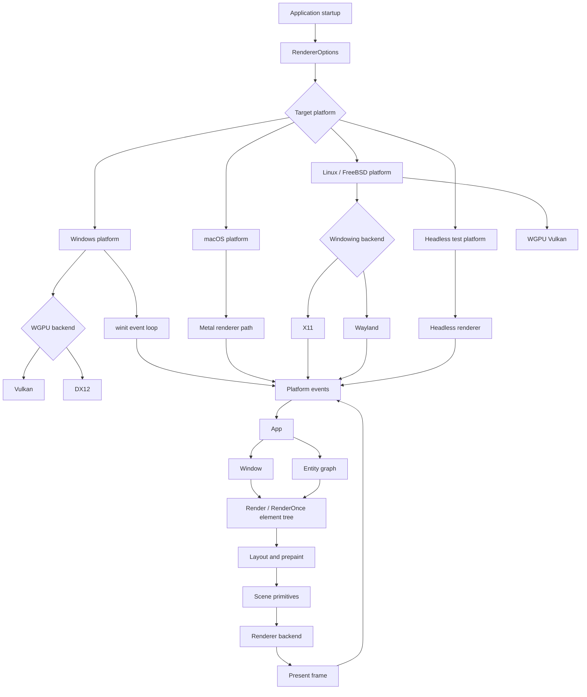
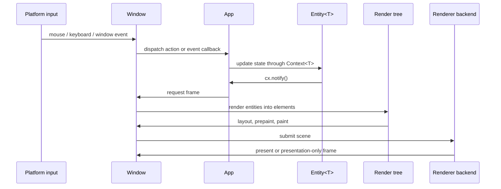
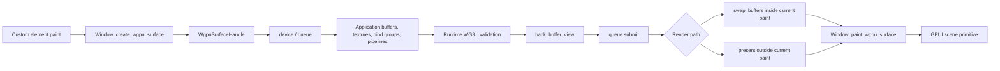

# GPUI

[English](README.md)

GPUI 是一个面向 Rust 桌面应用的 GPU 加速 UI 框架，结合了 immediate mode 和
retained mode。它在一个 crate 中提供应用状态、窗口、基于实体的视图、声明式
元素、输入分发、平台集成和渲染后端。

当前分支仍保持 GPUI pre-1.0 定位，同时更新了渲染和平台方向：

- Windows 使用基于 WGPU 和 winit 的平台路径。
- 默认渲染方向是 WGPU-first，并在 Windows 上支持 Vulkan 与 DX12 后端选择。
- 默认合成器是事件驱动的。连续渲染只用于显式配置
  `RenderPolicy::Continuous` 的窗口。
- 自定义 WGPU surface 可以渲染应用自己的 GPU 内容，再绘制回 GPUI 场景。
- WGSL shader 既可以作为内置渲染器 shader 在构建时校验，也可以在运行时由示例
  或应用加载。
- 示例已更新到当前 `App`、`Context<T>`、`Window` 和 `Entity<T>` API 形态。

## 快速开始

在 Rust 2024 项目中添加 GPUI，然后创建 `Application`：

```toml
[dependencies]
gpui = { version = "0.2.2" }
```

```rust
use gpui::{div, App, Application, Context, Render, Window};
use gpui::prelude::*;

struct Hello;

impl Render for Hello {
    fn render(&mut self, _window: &mut Window, _cx: &mut Context<Self>) -> impl IntoElement {
        div().child("Hello from GPUI")
    }
}

fn main() {
    Application::new().run(|cx: &mut App| {
        cx.open_window(Default::default(), |_, cx| cx.new(|_| Hello))
            .expect("open window");
        cx.activate(true);
    });
}
```

## 核心概念

- `App` 是根上下文，负责 globals、windows、entities、menus、key bindings、
  assets 和平台服务。
- `Context<T>` 会在创建、更新、渲染或处理 `Entity<T>` 事件时提供。
- `Window` 会显式传入需要输入、焦点、绘制、帧请求、actions 或自定义 WGPU
  surface 的 render 与事件代码。
- `Entity<T>` 保存由 GPUI 管理的状态。通过 `Entity::update` 或
  `Context<T>` listener 更新实体，并在渲染需要变化时调用 `cx.notify()`。
- `Render` view 每帧构建元素树。`RenderOnce` component 是被消费式渲染的轻量
  元素配方。
- `cx.spawn(async move |cx| ...)` 和
  `window.spawn(cx, async move |cx| ...)` 用于前台异步任务。不能阻塞 UI 渲染的
  工作使用 `cx.background_spawn`。

新代码不要使用旧的应用层命名：`Model<T>`、`View<T>`、把 `AppContext` 当作具体
上下文类型、`ModelContext<T>`、`WindowContext` 和 `ViewContext<T>`。

## 架构

GPUI 围绕 foreground UI thread、entity state、显式 window state，以及应用启动时
选择的 renderer backend 组织。



### 帧流程

普通帧路径是事件驱动的。状态变化会 notify entities，windows 会合并 frame
requests，renderer 只在 scene state 或 presentation state 需要时重绘。



### 自定义 WGPU Surface 流程

自定义 GPU 内容使用 GPUI 的 WGPU device 和 queue，同时让应用渲染与 GPUI element
renderer 保持隔离。



### 原版 GPUI 架构对比

| 领域 | 原版 GPUI 方向 | 当前分支 |
| --- | --- | --- |
| Windows platform | DirectX-oriented Windows renderer path | 基于 WGPU 和 winit 的 Windows platform path |
| Windows backend selection | Platform-specific renderer implementation | `RendererBackend` 可选择 WGPU Vulkan 或 WGPU DX12 |
| Renderer default | Platform renderer chosen internally | 在支持的平台上采用 WGPU-first 方向，并暴露显式 renderer options |
| Frame scheduling | Redraw behavior tied closely to platform renderer loops | 事件驱动 composition，并支持 presentation-only frames |
| Shader model | Built-in renderer shaders owned by platform paths | 内置 WGSL validation，并提供 runtime WGSL helpers 给 custom surfaces |
| Custom GPU content | 主要通过 framework rendering primitives 扩展 | Application-owned WGPU surfaces 可绘制进 GPUI scene |
| Example API style | 旧示例可能使用 previous context 和 view terminology | 示例使用 `App`、`Context<T>`、显式 `Window` 和 `Entity<T>` |

## 渲染说明

`RendererOptions` 控制后端选择、GPU adapter 选择、present mode 偏好、render
policy 和 frame metrics。`RendererBackend::Auto` 会选择平台默认值。Windows 上
可以显式选择 `WgpuVulkan` 或 `WgpuDx12`。

默认渲染策略是事件驱动。`RequestFrameOptions::force_render` 表示 layout 和
paint 需要变脏；`RequestFrameOptions::require_presentation` 允许在已准备内容或
WGPU surface 需要可见时走 presentation-only 帧。

自定义 GPU 内容可通过 `Window::create_wgpu_surface` 创建 `WgpuSurfaceHandle`，
渲染到 `back_buffer_view`，根据渲染路径调用 `present` 或 `swap_buffers`，再用
`Window::paint_wgpu_surface` 绘制。

## 文档

- [文档索引](docs/README.zh-CN.md)
- [开发指南](docs/development.zh-CN.md)
- [上下文与实体](docs/contexts.zh-CN.md)
- [运行时 WGSL shader](docs/runtime_wgsl_shaders.zh-CN.md)
- [WGPU surfaces](docs/wgpu_surfaces.zh-CN.md)
- [示例](docs/examples.zh-CN.md)
- [验证](docs/validation.zh-CN.md)

## 示例

示例已更新到当前 GPUI API：

```powershell
cargo check --manifest-path Cargo.toml --no-default-features --features windows-manifest,mimalloc-collect --examples
cargo run --manifest-path Cargo.toml --example hello_world
cargo run --manifest-path Cargo.toml --example minimal_window
cargo run --manifest-path Cargo.toml --example hatsune_miku_viewer
```

部分示例是平台专用的。自定义 WGPU surface viewer 目前只在 Windows 上启用完整
实现。

## 验证

建议使用以下命令验证本 crate：

```powershell
cargo fmt --manifest-path Cargo.toml --all
cargo check --manifest-path Cargo.toml --no-default-features --features windows-manifest,mimalloc-collect
cargo clippy --manifest-path Cargo.toml --no-default-features --features windows-manifest,mimalloc-collect --lib -- -D warnings
cargo check --manifest-path Cargo.toml --no-default-features --features windows-manifest,mimalloc-collect --examples
```
