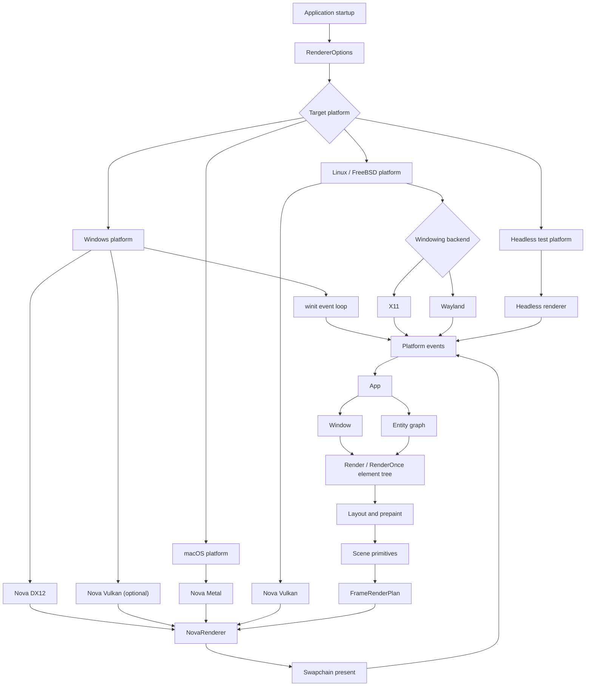
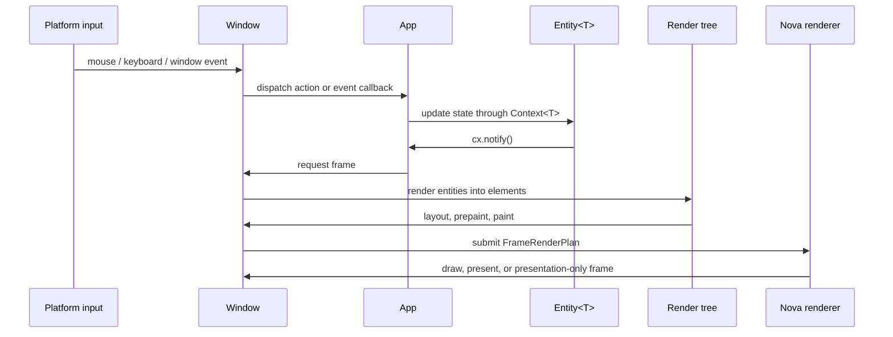

# GPUI

[English](README.md)

GPUI 是一个面向 Rust 桌面应用的 GPU 加速 UI 框架，结合了 immediate mode 和
retained mode。它在一个 crate 中提供应用状态、窗口、基于实体的视图、声明式
元素、输入分发、平台集成和渲染后端。

这个 vendored 分支保持 GPUI pre-1.0 定位，并服务于 BMCBL 原生桌面 UI。当前渲染
方向是 nova-gfx：

- Windows 使用 winit 平台路径，并在启用对应 feature 时默认走 Nova DX12 后端。
- Vulkan 通过 Nova Vulkan 后端提供，包括可选的 Windows Vulkan 路径。
- macOS 框架代码的普通 nova-gfx 路径面向 Nova Metal。
- 默认合成策略是事件驱动。连续渲染只用于显式配置
  `RenderPolicy::Continuous` 的窗口。
- 自定义 GPU 内容应通过 scene primitives、图片元素、runtime WGSL shader helper
  或自定义 3D mesh primitive 接入，而不是已经移除的 application-facing surface
  API。
- WGSL shader 既可作为内置 renderer shader 在构建时校验，也可在运行时由 custom
  mesh 示例或应用加载。
- 示例使用当前 `App`、`Context<T>`、显式 `Window` 和 `Entity<T>` API 形态。

## 快速开始

在本仓库应用中使用 vendored path dependency：

```toml
[dependencies]
gpui = { path = "vendor/gpui", default-features = false, features = [
    "mimalloc-collect",
    "nova-gfx",
    "nova-gfx-dx12",
    "nova-gfx-vulkan",
] }
```

创建 `Application` 并挂载实体视图：

```rust
use gpui::prelude::*;
use gpui::{div, App, Application, Context, IntoElement, Render, Window};

struct Hello;

impl Render for Hello {
    fn render(&mut self, _window: &mut Window, _cx: &mut Context<Self>) -> impl IntoElement {
        div().child("Hello from GPUI")
    }
}

fn main() {
    Application::new().run(|cx: &mut App| {
        cx.open_window(Default::default(), |_, cx| cx.new(|_| Hello))
            .expect("open window");
        cx.activate(true);
    });
}
```

## 核心概念

- `App` 是根上下文，负责 globals、windows、entities、menus、key bindings、
  assets 和平台服务。
- `Context<T>` 会在创建、更新、渲染或处理 `Entity<T>` 事件时提供。
- `Window` 会显式传入需要输入、焦点、绘制、帧请求、actions、平台状态或自定义
  paint 的 render 与事件代码。
- `Entity<T>` 保存由 GPUI 管理的状态。通过 `Entity::update` 或
  `Context<T>` listener 更新实体，并在渲染需要变化时调用 `cx.notify()`。
- `Render` view 构建元素树。`RenderOnce` component 是被消费式渲染的轻量元素配方。
- `cx.spawn(async move |cx| ...)` 和
  `window.spawn(cx, async move |cx| ...)` 用于前台异步任务。不能阻塞 UI 渲染的工作
  应使用后台 executor 或 blocking task。

新代码不要使用旧的应用层命名：`Model<T>`、`View<T>`、把 `AppContext` 当作具体
上下文类型、`ModelContext<T>`、`WindowContext` 和 `ViewContext<T>`。

## 架构

GPUI 围绕 foreground UI thread、entity state、显式 window state，以及应用启动时
选择的 renderer backend 组织。



## 帧流程

普通帧路径是事件驱动的。状态变化会 notify entities，windows 会合并 frame
requests，renderer 只在 scene state 或 presentation state 需要时重绘。



`RequestFrameOptions::force_render` 表示 layout 和 paint 需要变脏。
`RequestFrameOptions::require_presentation` 允许在已准备内容或 retained GPU output
需要可见时走 presentation-only 帧。

## 自定义 GPU 内容

旧的 application-facing surface 流程已经不是当前 GPUI API。新的自定义 GPU 内容
应使用以下路径：

- 普通 element paint 写入 GPUI scene primitives；
- image 和 SVG elements；
- custom mesh pipeline 使用的 runtime WGSL shader modules；
- 使用 `GpuMesh3d`、`GpuMesh3dShader` 和 `GpuMesh3dDrawParameters` 的自定义
  3D mesh primitives；
- 通过明确的 GPUI scene 或 renderer extension point 暴露应用级 render targets。

这样可以保持 renderer backend-neutral。应用代码不应假设存在 backend-specific
device、queue 或 surface handle。

## 原版 GPUI 架构对比

| 领域 | 原版 GPUI 方向 | 当前 vendored 分支 |
| --- | --- | --- |
| Windows platform | DirectX-oriented Windows renderer path | winit platform path with nova-gfx backends |
| Windows backend selection | Platform-specific renderer implementation | `RendererBackend` 可选择 `NovaDx12` 或 `NovaVulkan` |
| Renderer default | Platform renderer chosen internally | Windows 可用时默认 Nova DX12，Linux/FreeBSD 默认 Nova Vulkan，macOS 默认 Nova Metal |
| Frame scheduling | Redraw behavior tied closely to platform renderer loops | 事件驱动 composition，并支持 presentation-only frames |
| Shader model | Built-in renderer shaders owned by platform paths | 内置 WGSL validation，并提供 runtime WGSL helpers 给 custom mesh shader |
| Custom GPU content | 主要通过 framework rendering primitives 扩展 | Scene primitives、图片、SVG、runtime shader helpers 和 custom mesh primitives |
| Example API style | 旧示例可能使用 previous context 和 view terminology | 示例使用 `App`、`Context<T>`、显式 `Window` 和 `Entity<T>` |

## 渲染说明

`RendererOptions` 控制后端选择、GPU adapter 选择、present mode 偏好、GPU submission
policy、render policy 和 frame metrics。`RendererBackend::Auto` 会选择平台默认值。
显式后端包括 `NovaDx12`、`NovaVulkan`、`NovaMetal` 和 `HeadlessTest`。

nova-gfx 路径会把 GPUI scene 转换为 frame upload buckets、GPU render steps、可选的
offscreen path/backdrop passes、retained present-cache 更新和 swapchain presentation。
当 dirty region 可以安全限定时使用 partial redraw，否则 renderer 会回退到 full
redraw。

## 文档

- [文档索引](docs/README.zh-CN.md)
- [开发指南](docs/development.zh-CN.md)
- [上下文与实体](docs/contexts.zh-CN.md)
- [渲染与元素](docs/rendering.zh-CN.md)
- [Renderer backend](docs/renderer_backend.zh-CN.md)
- [Windows renderer backend](docs/windows_renderer_backend.zh-CN.md)
- [运行时 WGSL shaders](docs/runtime_wgsl_shaders.zh-CN.md)
- [Performance pipeline](docs/performance_pipeline.zh-CN.md)
- [示例](docs/examples.zh-CN.md)
- [验证](docs/validation.zh-CN.md)

BMCBL 集成级渲染说明位于从当前目录访问的
`../../docs/GPUI_VENDOR_RENDERING.md`。

## 示例

示例保持在当前 GPUI API：

```powershell
cargo check --manifest-path Cargo.toml --no-default-features --features windows-manifest,mimalloc-collect,nova-gfx-dx12 --examples
cargo run --manifest-path Cargo.toml --example hello_world
cargo run --manifest-path Cargo.toml --example minimal_window
cargo run --manifest-path Cargo.toml --example image_gallery
```

部分示例是平台专用的。runtime shader 和 custom mesh 示例必须声明所需 renderer
features。

## 验证

建议使用以下命令验证本 crate：

```powershell
cargo fmt --manifest-path Cargo.toml --all
cargo check --manifest-path Cargo.toml --no-default-features --features windows-manifest,mimalloc-collect,nova-gfx-dx12
cargo clippy --manifest-path Cargo.toml --no-default-features --features windows-manifest,mimalloc-collect,nova-gfx-dx12 --lib -- -D warnings
cargo check --manifest-path Cargo.toml --no-default-features --features windows-manifest,mimalloc-collect,nova-gfx-dx12 --examples
```
